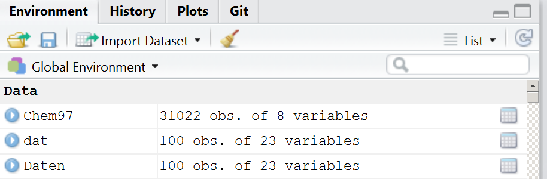
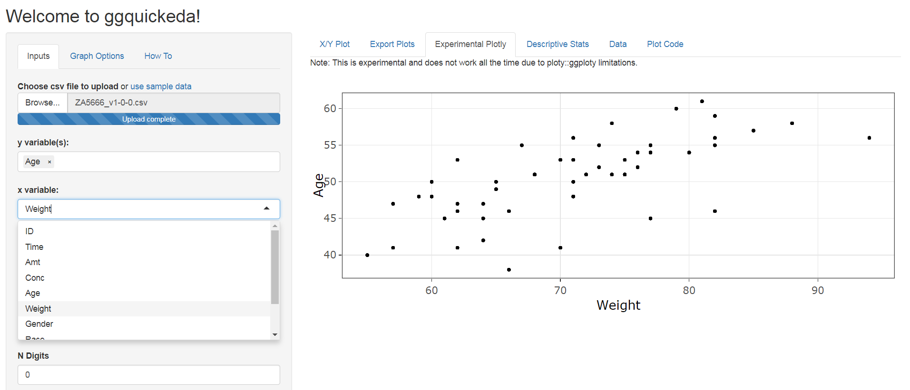

```{r, include=FALSE}
knitr::opts_chunk$set(echo = T,message=F,warning = F,cache=T)
showSolution=F
```


```{r,echo=F,eval=F}
library("readstata13")
dat <- read.dta13("../data/ZA5666_v1-0-0_Stata14.dta")
# dat <- dat[1:100,]
save(dat,file="../data/ZA5666_v1-0-0_medium.RData")

datf <- read.dta13("../data/ZA5666_v1-0-0_Stata14.dta",
                   convert.factors = F)

# datf <- datf[1:100,]
save(datf,file="../data/ZA5666_v1-0-0_medium_fac.RData")
```

## Inhalt dieses Abschnitts

```{r,echo=F,eval=F}
library(knitr)
sched <- xlsx::read.xlsx2("../orga/schedule.xlsx",1)
dats <- sched[9:15,c(1,4,5)]
dats <- dats[-which(dats$Part=="Break"),]

kable(dats,row.names = F)
```

### Was uns die Daten sagen.

- Wie bekommt man einen Überblick über die Daten
- Indizieren von Vektoren, Datensätzen und Listen
- Wie geht man mit fehlenden Werten um
- Zusammenhänge zwischen Variablen

## `data.frame`'s


- Beispieldaten importieren:

```{r}
dat <- read.csv2("../data/wahldat_ffm.csv")
```


```{r}
head(names(dat))
```


## Anzahl Zeilen und Spalten

- Anzahl der Zeilen/Spalten ermitteln

```{r}
nrow(dat) # Zeilen
ncol(dat) # Spalten
```

## Die Daten ansehen

- Die ersten Zeilen sehen:

```{r,eval=F}
head(dat) # erste Zeilen
tail(dat) # letzte Zeilen
```

- Einen Überblick mit Rstudio bekommen:



```{r}
View(dat)
```


## Indizierung eines `data.frame`

```{r}
dat[1,1] # das Element oben links bekommen
```

```{r,eval=F}
dat[2,] # nur die zweite Zeile sehen
```

```{r,echo=F}
dat[2,1:4] # nur die zweite Zeile sehen
```


```{r,eval=F}
dat[,1] # sich nur die erste Spalte anzeigen lassen 
```

```{r,echo=F}
head(dat[,1]) # sich nur die erste Spalte anzeigen lassen 
```


## Weitere Möglichkeiten zur Indizierung eines `data.frame`


```{r,eval=F}
dat[1:2,] # getting the first two rows
```

```{r,echo=F}
head(dat[1:2,1:10]) # getting the first two rows
```


## Indizierung

- Das Dollarzeichen kann auch zur Adressierung einzelner Spalten verwendet werden.

```{r}
head(dat$Stadtteilname)

dat$Stadtteilname[1:10]
```

## Zugriff auf Spalten

- Wie bereits beschrieben, können Sie über Zahlen auf die Spalten zugreifen.


```{r,eval=T}
head(dat[,3])
head(dat[,"Stadtteilname"]) # dasselbe Ergebnis
```


## Logische Operatoren

```{r}
(a <- 1:7) # Beispieldaten - numerisch
```

```{r}
a>4
a>=4
a<3
```

## Logische Operatoren II 

```{r}
(b <- letters[1:7]) # Beispieldaten - Strings
b=="e"
b %in% c("e","f")
```


## GESIS Panel Variable - Estimated duration (bazq020a)

### Wie lange haben Sie den Fragebogen ausgefüllt?

```{r}
wahlberechtigte <- as.numeric(dat$Wahlberechtigte.insgesamt)
```

```{r}
summary(wahlberechtigte)
```


## [Missing values ](http://faculty.nps.edu/sebuttre/home/R/missings.html)

- Fehlende Werte sind in R als `NA` definiert

```{r}
wahlberechtigte[5] <- NA
```


- Bei mathematische Funktionen gibt es in der Regel eine Möglichkeit, fehlende Werte auszuschließen.
- Bei `mean(), median(), colSums(), var(), sd(), min()` und `max()` gibt es das Argument `na.rm`.


```{r}
mean(wahlberechtigte)
```

```{r}
mean(wahlberechtigte,na.rm=T)
```

## Die fehlenden Werte finden

```{r}
is.na(head(wahlberechtigte))
```

```{r}
which(is.na(wahlberechtigte))
```

```{r}
table(is.na(wahlberechtigte))
```

## Der Befehl `complete.cases()`

```{r}
# Beispiel Datensatz
mydata <- data.frame(A=c(1,NA,9,6),B=c("A","B",1,NA))
```

- Der Befehl `complete.cases()` gibt einen logischen Vektor zurück, der angibt, welche Fälle vollständig sind.

```{r,eval=T}
# Datenzeilen mit fehlenden Werten auflisten 
mydata[complete.cases(mydata),]
```

## [Verschiedene Arten von fehlenden Werten (NAs) spezifizieren](https://stackoverflow.com/questions/16074384/specify-different-types-of-missing-values-nas)

```{r,eval=F,echo=F}
install.packages("memisc")
```

- Spezifiziere verschiedene Arten von Fehlern mit dem Paket `memisc`. 
- Benutze dazu den Befehl `include.missings()`

```{r,eval=F,echo=F}
install.packages("memisc")
```


```{r}
library(memisc)
```

```{r,eval=F}
?include.missings
```


- Es ist auch möglich, Codebuch-Einträge mit `memisc` zu erstellen.

```{r,eval=F}
codebook(dat$Wähler)
```

<!--
## Another function

```{r}
name1 <- tolower(c("DEEPAYAN","SARKAR"))
```

```{r}
firstup <- function(x) {
   substr(x, 1, 1) <- toupper(substr(x, 1, 1))
    return(x)
}
```

```{r}
firstup(name1)
```
-->

## Kategoriale Variable einführen

```{r}
dat$wb_kat <- cut(dat$Wahlbeteiligung,3)
head(dat$wb_kat)
```

```{r}
levels(dat$wb_kat) <- c("niedrig","mittel","hoch")
head(dat$wb_kat)
```


## Datensatz indizieren

<!--
-->

```{r}
table(dat$wb_kat)
```

```{r,eval=F}
dat[dat$wb_kat=="mittel","Stadtteilname"]
dat[dat$wb_kat!="mittel","Stadtteilname"]
```


```{r,echo=F,eval=F}
head(dat[dat$wb_kat=="mittel","Stadtteilname"])
head(dat[dat$wb_kat!="mittel","Stadtteilname"])
```


## Weitere wichtige Optionen

- Speichern des Ergebnisses in einem Objekt


```{r}
subDat <- dat[dat$Wahlbeteiligung>65,]
```

- mehrere Bedingungen können mit `&` verknüpft werden


```{r,eval=F}
dat[dat$Anteil.DIE.LINKE>12 & dat$Anteil.GRÜNE>25,"Stadtteilname"]
```

- das oder das Argument - eine der beiden Bedingungen muss erfüllt sein

```{r,eval=F}
dat[dat$Anteil.CDU>28 | dat$Anteil.AfD>28,"Stadtteilname"]
```


## Umbenennen der Spaltennamen

- Mit dem Befehl `colnames` erhält man die Spaltennamen

```{r,eval=F}
colnames(dat)
```

- Wir können die Spaltennamen umbenennen:

```{r,eval=F}
colnames(dat)[1] <- "Nummer"
```

- Das gleiche gilt für die Zeilennamen

```{r,eval=F}
rownames(dat)
```


## Exkurs - Wie man Labels verwendet 

### Werkzeuge für das Arbeiten mit kategorialen Variablen (Faktoren) 

```{r}
library("forcats") 
```

- `fct_collapse` -  um Faktorstufen zu verdichten
- `fct_count` - um die Einträge in einem Faktor zu zählen
- `fct_drop`	- Entferne unbenutzte Levels

## Der Befehl `fct_count`

### Wahlbeteiligung - fünf Kategorien

```{r,echo=F}
dat$wbkat5 <-as.factor(cut(dat$Wahlbeteiligung,5,labels=F))
```


```{r}
fct_count(f = dat$wbkat5)
```

## Der Befehl `fct_collapse`

```{r}
wbkat <- fct_collapse(.f = dat$wbkat5,
    hoch=c("4","5"))
```

```{r}
fct_count(wbkat)
```


## Die `apply` Familie

```{r}
(ApplyDat <- cbind(1:4,runif(4),rnorm(4))) #Example 
```

```{r}
apply(ApplyDat,1,mean)
apply(ApplyDat,2,mean)
```


## Der Befehl `apply()`

```{r}
apply(ApplyDat,1,var)
apply(ApplyDat,1,sd)
apply(X = ApplyDat,MARGIN = 1,FUN = range)
```

## Die Argumente des Befehls `apply()`

- Wenn `MARGIN=1` wird die Funktion `mean` auf die Reihen angewendet,

- Wenn `MARGIN=2` wird die Funktion `mean` auf die Spalten angewendet,

- Anstatt `mean` kann man auch `var`, `sd` oder `length` verwenden.

## Der Befehl `tapply()`

```{r}
ApplyDat <- data.frame(Income=rnorm(5,1400,200),
                       Sex=sample(c(1,2),5,replace=T))
```


### Beispiel Befehl `tapply()`

```{r}
tapply(ApplyDat$Income,
       ApplyDat$Sex,function(x)x)
```

- Andere Befehle können auch verwendet werden..... auch selbst geschriebene 


## Übung  - `tapply()` Befehl verwenden

- Importieren Sie den [**Datensatz zur Landtagswahl in Hessen 2018**](http://offenedaten.frankfurt.de/dataset/landtagswahl-hessen-2018/resource/98812021-fc2a-446b-88c0-67e5180af948)
- Erstellen Sie eine Variable `wbkat`, in der sie die Wahlbeteiligung in den Stadtteilen in fünf Kategorien einteilen. 
- Berechnen Sie mit Hilfe des `tapply` Befehls den durchschnittlichen Anteil der AFD pro Wahlbeteiligungskategorie.

<!--
## Übung - `apply` Funktion anwenden

- Erstellen Sie eine Matrix A mit 4 Zeilen und 25 Spalten, die die Werte 1 bis 100 enthält. Analog dazu erstellen Sie eine Matrix B mit 25 Zeilen und 4 Spalten, die die Werte 1 bis 100 enthält.

- Berechnen Sie mittels dem `apply()`-Befehl den Mittelwert und die Varianz für jede Zeile von A bzw. B.

- Berechnen Sie mittels dem `apply()`-Befehl den Mittelwert und die Varianz für jede Spalte von
A bzw. B.

- Standardisieren ist eine häufige Transformation von        Daten;        dafür        wird        der        Mittelwert        von der entsprechenden        Zeile        oder        Spalte        abgezogen        und        durch        die        entsprechende        Standardabweichung         geteilt.             Somit         besitzen         die         Daten         einen         Mittelwert         von         0         und         eine         Standardab-
weichung        von        1.           Standardisieren        Sie        die        Spalten        der        Matrix
A
.
-->


## Edgar Anderson's Iris Datensatz

```{r}
data(iris)
```


```{r,eval=F}
head(iris)
```

```{r,echo=F}
head(iris[,1:4])
```


- petal length and width - Länge und Breite der Blütenblätter

- sepal length and width - Kelchlänge und -breite

- [**Wikipedia Artikel zum IRIS Datensatz**](https://en.wikipedia.org/wiki/Iris_flower_data_set)

## Zusammenhang zwischen kontinuierlichen Variablen

```{r}
# Pearson correlation coefficient
cor(iris$Sepal.Length,iris$Petal.Length)
```

- Zusammenhang zwischen Blütenblattlänge und Blütenblattlänge ist 0,87
- Der Pearson-Korrelationskoeffizient ist die Standardmethode in `cor()`.


## Verschiedene Korrelationskoeffizienten


```{r}
# Pearson correlation coefficient
cor(iris[,1:4]) 
```

```{r}
# Kendall's tau (rank correlation)
cor(iris[,1:4], method = "kendall") 
```


## Spearman's $\rho$

```{r}
# Spearman's rho (rank correlation)
cor(iris[,1:4], method = "spearman") 
```


## Eine zweidimensionale Kreuztabelle erstellen

### Variablen

```{r}
dat <- read.csv2("../data/bauenwohnen_teil.csv")
```


- `Spiel100K` - Wohnumfeld  öffentlicher Raum - Spielplätze je 100 Kinder 2012
- `baugenehm12` - Baugenehmigungen - Neue Ein/Zweifamilienhäuser 2012

### Tabelle erstellen

```{r}
tab <- table(dat$Spiel100K,dat$baugenehm12)
```

## Kreuztabelle anschauen

### Tabelle

```{r,echo=F}
tab
```


## Beziehung zwischen kategorialen Variablen

- `chisq.test()`prüft, ob zwei kategoriale Merkmale stochastisch unabhängig sind.
- Der Test wird gegen die Nullhypothese der Gleichverteilung durchgeführt.

```{r}
chisq.test(tab)
```


<!--
https://support.minitab.com/de-de/minitab/18/help-and-how-to/modeling-statistics/regression/how-to/fit-binary-logistic-model/methods-and-formulas/diagnostic-measures/
-->

## Übung - eine interaktive Tabelle

- Laden Sie den Datensatz `bauenwohnen_teil.RData` vom [**Github Verzeichnis**](https://github.com/Japhilko/ffm_rintro/2019/data/) herunter.
- Importieren Sie den Datensatz in R 
- Erstellen Sie eine interaktive Tabelle mit den folgenden Befehlen:

```{r,eval=F}
library(DT)
DT::datatable(dat)
```

- Probieren Sie witere Argumente der Funktion `datatable` aus.


## Shiny App für eine schnelle explorative Datenanalyse

https://pharmacometrics.shinyapps.io/ggplotwithyourdata/




## Weitere Links

- [**Tidy data**](https://cran.r-project.org/web/packages/tidyr/vignettes/tidy-data.html) - das Paket `tidyr`

- Homepage für: [**the `tidyverse` collection**](http://tidyverse.org/)

- [**Data wrangling mit R und RStudio**](https://www.rstudio.com/resources/webinars/data-wrangling-with-r-and-rstudio/)


```{r,eval=F,echo=F}
# https://github.com/BAAQMD/copydat
devtools::install_github("BAAQMD/copydat")
install.packages("questionr")
devtools::install_github("ThinkR-open/littleboxes") # https://github.com/ThinkR-open/littleboxes
```

- Hadley Wickham - [**Tidy Data**](http://vita.had.co.nz/papers/tidy-data.pdf)
- Hadley Wickham - [**Advanced R**](http://adv-r.had.co.nz/)
- Colin Gillespie and Robin Lovelace [**Efficient R programming**](https://csgillespie.github.io/efficientR/)
