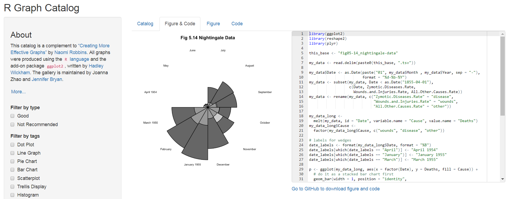

```{r, include=FALSE}
knitr::opts_chunk$set(echo = TRUE,message=F,warning = F,cache=F, fig.height=4)
GESIS <- T
athome <- !GESIS
```


## Eine Graphik sagt mehr als 1000 Worte.

### Aussagen zu Graphen in R

- Die grafische Datenanalyse ist großartig.
- Gute Graphiken können zu einem besseren Verständnis beitragen.
- Die Erzeugung eines Plot ist einfach.
- Einen guten Plot zu erstellen, kann sehr lange dauern.
- Das Erstellen von Plots mit R macht Spaß.
- Mit R erstellte Diagramme haben eine hohe Qualität.
- Fast jedes Graphikformat wird von R unterstützt.
- Eine große Anzahl von Exportformaten ist in R verfügbar.


## Nicht alle Diagramme sind gleich.

- Das Basispaket enthält bereits eine Vielzahl von Plotfunktionen.
- Andere Pakete wie `lattice`, `ggplot2`, etc. erweitern diese Funktionalität.

### Handbücher, die weit über diese Einführung hinausgehen:

- Murrell, P (2006): R Graphics.
- R Development Core Group [**Graphiken mit R**](https://csg.sph.umich.edu/docs/R/graphics-1.pdf)
- Wiki zu [**R Programmierung/Graphiken**](https://en.wikibooks.org/wiki/R_Programming/Graphics)
- Martin Meermeyer [**Creating Reproducible Publication Quality Graphics with R: A Tutorial**](http://elpub.bib.uni-wuppertal.de/edocs/dokumente/fbb/wirtschaftswissenschaft/sdp/sdp15/sdp15006.pdf)
- Institute for Quantitative Social Science at Harvard - [**R Graphik Tutorial**](https://tutorials.iq.harvard.edu/R/Rgraphics/Rgraphics.html)


<!--
mentioned later:
https://cran.r-project.org/doc/contrib/usingR.pdf

to specific:
https://www.stat.auckland.ac.nz/~paul/R/graphicsqc.pdf
-->

##  Task View für [Graphiken](https://cran.r-project.org/web/views/Graphics.html)


https://cran.r-project.org/web/views/Graphics.html


## Daten importieren

```{r}
load("../data/bauenwohnen_teil.RData")
```


## Histogramm - Die Funktion `hist()` 

Wir erstellen ein Histogramm der Variablen `Dauer`:

```{r,eval=F}
?hist
```


```{r,eval=T,fig.width=12, fig.height=5}
hist(dat$Spielplaetze_100k)
```
<!--

-->

## Export mit Rstudio


## Befehl zum Speichern der Grafik

- Alternativ auch mit den Befehlen `png`, `pdf` oder `jpeg` zum Beispiel.

```{r,eval=F}
png("Histogramm.png")
  hist(dat$Spielplaetze_100k)
dev.off()
```

```{r,eval=F}
pdf("Histogramm.pdf")
  hist(dat$Spielplaetze_100k)
dev.off()
```

```{r,eval=F}
jpeg("Histogramm.jpeg")
  hist(dat$Spielplaetze_100k)
dev.off()
```


## Histogramm

- Der Befehl `hist()` zeichnet ein Histogramm.
- Mindestens ein Beobachtungsvektor muss an die Funktion übergeben werden.
- `hist()` hat viele weitere Argumente, die alle (sinnvolle) Standardwerte haben.

```{r,eval=F}
hist(dat$Spielplaetze_100k,col="blue",
     main="Spielplätze je 100 Kinder 2012",ylab="Frequency", 
     xlab="Spielplätze")
```

<!--
## Histogram
-->
```{r,echo=F,eval=F}
hist(dat$Spielplaetze_100k,col="blue",
     main="Spielplätze je 100 Kinder 2012",ylab="Frequency", 
     xlab="Spielplätze")
```

## Rstudio Addin `colourpicker`

```{r,eval=F}
install.packages("colourpicker")
```


## Weitere Argumente:

```{r,eval=F}
?plot
# or
?par
```


## Das `xlim` Argument

```{r,eval=T,fig.width=10, fig.height=4}
hist(dat$Spielplaetze_100k,col="blue",
     main="Spielplätze je 100 Kinder 2012",ylab="Frequency", 
     xlab="Spielplätze",xlim=c(0,2))
```


<!--

-->

## Das `breaks` Argument

- Während die vorherigen Argumente für viele Grafikfunktionen gelten, gilt das Folgende hauptsächlich für Histogramme:

```{r,eval=F}
hist(dat$Spielplaetze_100k,col="red",
     main="Spielplätze je 100 Kinder 2012",ylab="Häufigkeit", 
     xlab="Spielplätze",breaks=20)
```

- Mit `breaks` kann man die Zahl der Balken kontrollieren:

<!--

-->
## Tabellieren und `barplot`

- Der Befehl `barplot()` erzeugt einen Barplot aus einer Frequenztabelle.
- Wir erhalten die Tabelle mit dem folgenden Befehl:

```{r}
tab_spiel <- table(dat$Spiel100K)
```


```{r,eval=F}
barplot(tab_spiel)
```


## Mehr Farbe:

```{r,eval=T}
barplot(tab_spiel,col=rgb(0,0,1))
```

## Grüne Farbe 

```{r}
barplot(tab_spiel,col=rgb(0,1,0))
```

## Rote Farbe

```{r}
barplot(tab_spiel,col=rgb(1,0,0))
```


## Transparent

```{r}
barplot(tab_spiel,col=rgb(1,0,0,.3))
```


## Eine zweidimensionale Tabelle

- Wenn das übergebene Tabellenobjekt zweidimensional ist, wird ein bedingter Barplot erstellt.


```{r}
tab2dim <- table(dat$Spiel100K,dat$clust)
```


## Bedingter `barplot`


<!--
```{r,eval=F}
barplot(tab2dim,col=1:3)
```


-->


```{r,eval=T}
barplot(tab2dim,col=2:4,beside=T)
```

<!--

-->

## Horizontaler Boxplot

- Ein einfacher [**boxplot**](http://edoc.hu-berlin.de/dissertationen/gruenwald-andreas-2005-01-17/HTML/chapter2.html) kann mit `boxplot()` erstellt werden.
- Für den Befehl `boxplot()` muss mindestens ein Beobachtungsvektor übergeben werden.

```{r,eval=F}
?boxplot
```


```{r,eval=T,fig.width=12, fig.height=5}
boxplot(dat$wohnungsbestand,horizontal=TRUE)
```

<!--

-->

## Gruppierte Boxplots

- Ein sehr einfacher Weg, sich einen ersten Eindruck von bedingten Verteilungen zu verschaffen, ist über sogenannte gruppierte Boxplots.
- Dazu muss ein sogenanntes Formelobjekt an die Funktion `boxplot()` übergeben werden.
- Die bedingte Variable befindet sich auf der rechten Seite einer Tilde.

<<<<<<< HEAD
```{r,eval=T}
boxplot(dat$wohnungsbestand~dat$Spiel100K,horizontal=TRUE)
=======
```{r,eval=T,fig.width=12, fig.height=5}
boxplot(wohnungsbestand~clust,data=dat,horizontal=TRUE)
>>>>>>> ee50037238e611f0d1b244af2fbebc5ffebe7971
```

<!--

-->


## Boxplot Alternativen - `vioplot` 

- Baut auf dem `boxplot` auf  - Zusatzinformationen zur Dichte 
- Die Dichte wird mit der Kernel-Methode berechnet.
- Je weiter die Ausdehnung, desto höher ist die Dichte an dieser Stelle. 
- Weißer Punkt - Medianwert

```{r,echo=F,eval=F}
install.packages("vioplot")
```

```{r,eval=T,fig.width=12, fig.height=5}
library(vioplot)
vioplot(na.omit(dat$wohnungsbestand),col="royalblue")
```

<!--

-->


```{r,message=F,eval=F,echo=F,fig.width=12, fig.height=5}
library(vioplot)
plot(x, y, xlim=c(-5,5), ylim=c(-5,5))
vioplot(x, col="tomato", horizontal=TRUE, at=-4, 
        add=TRUE,lty=2, rectCol="gray")
vioplot(y, col="cyan", horizontal=FALSE, at=-4, 
        add=TRUE,lty=2)
```

## Alternativen zum `boxplot()`

```{r,echo=F,eval=F}
install.packages("beanplot")
```


```{r}
library(beanplot)
par(mfrow = c(1,2))
boxplot(dat$wohnungsbestand~dat$clust,data=dat,col="blue")
beanplot(dat$wohnungsbestand~dat$clust,data=dat,col="orange")
```

## Bedingte, bi- und multivariate Graphiken - Scatterplots

- Ein einfaches Streudiagramm kann mit der Funktion `plot()` erstellt werden.
- Um ein Scatterplot zu erstellen, müssen x und y als Beobachtungsvektoren übergeben werden.
- Argument `col` - Farbe als Zeichen oder numerisch
- Argument `pch` - Plotsymbol als Zeichen oder numerisch
- Achsenbeschriftung wird mit `xlab` und `ylab` definiert.


## Scatterplot

```{r,eval=F,echo=F}
install.packages("mlmRev")
```

```{r,eval=T}
plot(dat$wohnungsbestand,dat$bautaet)
```

<!--

-->

## Übung - Balkendiagramm `VADeaths`

- Laden Sie den Datensatz `VADeaths` und erstellen Sie die folgende Darstellung:

```{r,echo=F}
library(datasets)
data(VADeaths)
barplot(VADeaths, border = "dark blue",beside=T,
        col=c(1,2,3,4,5)) 
```


## Das `lattice`-Paket

### [**Definition einer `lattice` Graphik**](http://stat.ethz.ch/R-manual/R-devel/library/lattice/html/Lattice.html)

> It is designed to meet most typical graphics needs with minimal tuning, but can also be easily extended to handle most nonstandard requirements. 

### Beispiele für `lattice` Graphiken


## [Ein weiteres Addin für RStudio](https://github.com/homerhanumat/addinplots/)

- das `addinplots`-Paket installieren - den Datensatz markieren, der visualisiert werden soll, und einen  Plottyp wählen:

```{r,eval=F}
devtools::install_github("homerhanumat/addinplots")
```


```{r,eval=F,echo=F}
iris
```


## Benutzer Interface für `addinplots`


```{r,eval=F}
iris # Beispieldatensatz
```

## Ein Beispieldatensatz - Testergebnisse bei A-level Chemie Test aus dem Jahr 1997

```{r}
library("mlmRev")
data(Chem97)
```

```{r,echo=F}
library(knitr)
cats <- c("Local Education Authority","School identifier","Student identifier","Point score on A-level Chemistry in 1997","Student's gender","Age in month, centred at 222 months or 18.5 years","Average GCSE score of individual","Average GCSE score of individual, centered at mean")
c97dat <- data.frame(variables=colnames(Chem97),categories=cats)
kable(c97dat)
```


## Histogramm mit `lattice`

```{r,message=F,fig.width=12, fig.height=5}
library("lattice")
histogram(~ gcsescore, data = Chem97)
```


## Mehr Histogramme mit `lattice`

```{r,fig.width=12, fig.height=5}
histogram(~ gcsescore | score,data = Chem97)
```

## Die Dichte plotten mit einer Legende

```{r,fig.width=12, fig.height=5}
densityplot(~ gcsescore | score, Chem97, 
	groups=gender,auto.key=TRUE)
```

[**Einführung in das `lattice` Paket**](http://www.isid.ac.in/~deepayan/R-tutorials/labs/04_lattice_lab.pdf)

## Einen Boxplot mit `lattice` erzeugen

```{r,echo=T,eval=T,fig.width=12, fig.height=5}
Chem97$score <- as.factor(Chem97$score)
```

```{r,fig.width=12, fig.height=5}
bwplot(score ~ gcsescore | gender, Chem97)
```

## Bedingte Boxplots mit `lattice` erzeugen

```{r,fig.width=12, fig.height=5}
bwplot(gcsescore ~ gender | score, Chem97,
 layout = c(6, 1))
```

<!--
## Univariate plots

```{r,echo=F,eval=F}
barchart(yield ~ variety | site, data = barley,
         groups = year, layout = c(1,6), stack = TRUE,
         auto.key = list(space = "right"),
         ylab = "Barley Yield (bushels/acre)",
         scales = list(x = list(rot = 45)))
```

```{r,echo=F,eval=F}
barchart(gcsescore ~ lea | school, data = Chem97,groups = gender, stack = TRUE,
         auto.key = list(space = "right"),
         ylab = "Barley Yield (bushels/acre)",
         scales = list(x = list(rot = 45)))
```
-->


## Ein `densityplot`

```{r,fig.width=12, fig.height=5}
densityplot(~height|voice.part,data=singer,layout = c(2,4),
            xlab = "Height (inches)",bw = 5)
```

## Bivariate Plots - Quantile-Quantile Plot

```{r,fig.width=12, fig.height=5}
qq(gender ~ gcsescore | score, Chem97)
```

## Scatterplot mit `lattice` - `xyplot`

```{r,eval=F,echo=F}
xyplot(Sepal.Length + Sepal.Width ~ Petal.Length + Petal.Width 
       | Species,data=iris,scales="free",layout= c(2,2),
       auto.key = list(x = .6, y = .7, corner = c(0, 0)))
```

```{r,eval=T,fig.width=12, fig.height=5}
xyplot(Sepal.Length+Sepal.Width~Petal.Length+Petal.Width 
       | Species,data = iris, auto.key = T)
```

<!--

-->

## Zusammenhang zwischen Variablen - `pairs` Plot

```{r,fig.width=12, fig.height=5}
pairs(iris[,1:4])
```


## Den `pairs`Plot erweitert

```{r,eval=T,fig.width=12, fig.height=5}
library("psych")
pairs.panels(iris[,1:4],bg=c("red","yellow","blue")[iris$Species],
             pch=21,main="")
```

<!--

-->


## Multivariate Plots - `splom`

```{r,fig.width=12, fig.height=5}
splom(~iris[,1:4], groups = Species, data = iris)
```

## Mehr Argumente im `splom` Befehl

```{r,eval=F}
super.sym <- trellis.par.get("superpose.symbol")
splom(~iris[1:4], groups = Species, data = iris,
      panel = panel.superpose,
      key = list(title = "Three Varieties of Iris",
                 columns = 3, 
                 points = list(pch = super.sym$pch[1:3],
                 col = super.sym$col[1:3]),
                 text = list(c("Setosa", "Versicolor", 
                               "Virginica"))))
```


## Der Beispieldatensatz `BankWages`

```{r,echo=T,eval=F}
install.packages("AER")
```

```{r}
library("AER")
data(BankWages)
```

```{r}
head(BankWages)
```

## `levelplot`

- `education` in Jahren

```{r,message=F,eval=T}
library("lattice")
levelplot(table(BankWages$education,BankWages$job),
          xlab="education",ylab="job")
```

<!--

-->

## `levelplot` 

```{r}
tab2dim2 <- table(dat$clust,dat$Spiel100K)
```


```{r,message=F,fig.width=12, fig.height=5}
levelplot(tab2dim2,
col.regions=colorRampPalette(c("blue","white","red")))
```

<!--

-->


## Zusammenhang - kategoriale Variablen


```{r}
mosaicplot(tab2dim2, color = TRUE,main="")
```

<!--

-->


## Einfärbung nach Residuen:

```{r}
mosaicplot(tab2dim2, main="",shade = TRUE)
```

<!--
## Pearson residuals

- Chi-squared-Statistic of Pearson

$$
r_{p,i}=\dfrac{y_i - \hat{\mu_{i}}}{\sqrt{V(\hat{\mu_i})}}
$$
-->

## `parallelplot()`

```{r,fig.width=12, fig.height=8}
parallelplot(~iris[,1:4] | Species, iris,layout=c(3,1))
```

## Das `ggplot2` Paket

### [**Einführung `ggplot2`**](https://www.statmethods.net/advgraphs/ggplot2.html)

> The ggplot2 package, created by Hadley Wickham, offers a powerful graphics language for creating elegant and complex plots. Its popularity in the R community has exploded in recent years. Origianlly based on Leland Wilkinson's The Grammar of Graphics, ggplot2 allows you to create graphs that represent both univariate and multivariate numerical and categorical data in a straightforward manner. 

<!--
Grouping can be represented by color, symbol, size, and transparency. The creation of trellis plots (i.e., conditioning) is relatively simple. 
-->
### Beispiele `ggplot2` Graphiken


## Ein erstes Beispiel `ggplot2`


```{r,eval=T}
library(ggplot2)
ggplot(iris, aes(x=Sepal.Length, y=Sepal.Width)) + 
  geom_point()
```

<!--

-->

## Einige Rstudio Addins

- Eine `ggplot` Grafik muss im Quellcode markiert werden, um die folgenden Addins zu verwenden


```{r,eval=F}
install.packages("ggThemeAssist")
```

{height=60%}


```{r,eval=F}
install.packages('ggedit')
```

{height=60%}

## RStudio Addin zum Erzeugen von `ggplot2` Graphiken

```{r,eval=F}
devtools::install_github("dreamRs/esquisse")
```


## Shiny App - R Graphik Katalog

http://shinyapps.stat.ubc.ca/r-graph-catalog/



<!--
More shiny apps


the following apps do not work:
https://www.showmeshiny.com/ggplot-gui/
https://www.showmeshiny.com/ggplot2-theme-builder/
http://www.michalm.net/shiny/easyPlot/

http://www.michalm.net/shiny/easyPlot/
-->

## Ein Beispieldatensatz zu Diamanten

> A dataset containing the prices and other attributes of almost 54,000 diamonds.

- price - price in US dollars (\$326–\$18,823)

- carat - weight of the diamond (0.2–5.01)

- cut - quality of the cut (Fair, Good, Very Good, Premium, Ideal)

- color - diamond colour, from J (worst) to D (best)

- clarity - a measurement of how clear the diamond is (I1 (worst), SI2, SI1, VS2, VS1, VVS2, VVS1, IF (best))

<!--
- x - length in mm (0–10.74)

- y - width in mm (0–58.9)

- z - depth in mm (0–31.8)

- depth - total depth percentage = z / mean(x, y) = 2 * z / (x + y) (43–79)

- table - width of top of diamond relative to widest point (43–95)
-->

```{r}
data(diamonds)
```

- Der Datensatz ist zu groß für unsere Anwendungszwecke:

```{r}
d <- diamonds[sample(nrow(diamonds), 1000), ]
```


## Das Paket `plotly`

> Create Interactive Web Graphics via 'plotly.js'

```{r}
library(plotly)
```


## [Interaktivität hinzufügen](https://moderndata.plot.ly/interactive-r-visualizations-with-d3-ggplot2-rstudio/)

```{r,eval=F}
p <- ggplot(data = d, aes(x = carat, y = price)) +
  geom_point(aes(text = clarity,size = 4)) +
  geom_smooth(aes(colour = cut, fill = cut))+ 
  facet_wrap(~ cut)
```


### Es wird eine ggplot Graphik erzeugt

```{r,eval=F,echo=F}
p <- ggplot(data = d, aes(x = carat, y = price)) +
  geom_point(aes(text = paste("Clarity:",clarity)),size = 4) +
  geom_smooth(aes(colour = cut, fill = cut)) + facet_wrap(~ cut)
(gg <- ggplotly(p))
```


## Das Ergebnis - eine interaktive Graphik

```{r,eval=F}
ggplotly(p)
```


## Links 

- J H Maindonald - [**Lattice and Other Graphics in R**](https://maths-people.anu.edu.au/~johnm/r-book/2edn/xtras/rgraphics.pdf)

- Deepayan Sarkar - [**An introduction to R - lattice lab**](https://www.isid.ac.in/~deepayan/R-tutorials/labs/04_lattice_lab.pdf)

- Flowingdata - [**Comparing ggplot2 and R Base Graphics**](https://flowingdata.com/2016/03/22/comparing-ggplot2-and-r-base-graphics/)

- [**Quick R - ggplot2**](https://www.statmethods.net/advgraphs/ggplot2.html)

- [**Top 50 ggplot2 Visualizations**](http://r-statistics.co/Top50-Ggplot2-Visualizations-MasterList-R-Code.html)

- [**Bioconductor R manual**](http://manuals.bioinformatics.ucr.edu/home/R_BioCondManual) with an extensive part on graphics

- Shiny app to visualize [**ggplot2 internals**](https://gallery.shinyapps.io/ggtree/)

- [**Shiny app**](https://www.showmeshiny.com/ggedit/) for [**interactive plot editing**](https://metrumrg.shinyapps.io/ggedit/)

<!--
https://www.ae.be/blog-en/combining-the-power-of-r-and-d3-js/
-->
