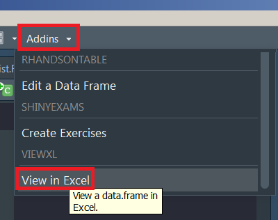
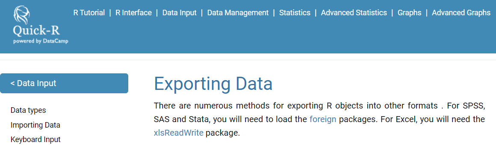

```{r, include=FALSE}
knitr::opts_chunk$set(echo = TRUE, warning = F,message = F)
```

## Erstellen eines Beispieldatensatzes


<!--
Ideen für dieses Kapitel:

- vielleicht ans Ende des zweiten Tages setzen und dann auch zeigen, wie man bspw. TeX Output erzeugt

- Wie kann man es wieder als Stata Datensatz speichern

- Vielleicht auch ein kleines Shiny Dashboard Beispiel machen

-->


```{r}
A <- c(1,2,3,4)
B <- c("A","B","C","D")

mydata <- data.frame(A,B)
```

```{r,eval=F}
mydata
```


```{r,eval=T,echo=F}
library(knitr)
kable(mydata)
```


## Übersicht Datenimport/-export

- wenn man weiterhin mit R arbeitet ist `.RData` oder [**`rds`**](https://www.fromthebottomoftheheap.net/2012/04/01/saving-and-loading-r-objects/) die beste Wahl:

```{r,eval=F}
save(mydata, file="mydata.RData")
saveRDS(mydata, "mydata.rds")
```

- Der Datensatz kann mit `load` importiert werden.

```{r,eval=F}
load("mydata.RData")
mydata <- readRDS("mydata.rds")
```

- `saveRDS()` speichert nicht das Objekt und seinen Namen, sondern nur eine Darstellung des Objekts.

## Export als Excel-Datensatz

<!--
```{r,eval=F,echo=F}
install.packages("tibble")
```

- Create a example tibble:

```{r}
library(tibble)
ab <- tibble(a=1:4,b=4:1)
```
-->

```{r,eval=F}
library(xlsx)
setwd("D:/Daten/GitHub/r_intro_gp18/data")
write.xlsx(mydata,file="mydata.xlsx")
```


## [Addin um Datensatz in Excel zu öffnen](https://github.com/dreamRs/viewxl)

```{r,eval=F}
devtools::install_github("dreamRs/viewxl")
```

- Wählt man ein `data.frame` im Skript aus wird es in Excel geöffnet. 

```{r,eval=F,echo=F}
iris
```



## Daten im `.csv` Format speichern

```{r,eval=F}
write.csv(mydata,file="mydata.csv") 
```

- Wenn Sie weiterhin mit deutschem Excel arbeiten wollen, ist es besser, `write.csv2` zu verwenden. 

```{r,eval=F}
write.csv2(mydata,file="mydata.csv") 
```

- Ansonsten sieht das Ergebnis so aus:


## Das Argument `row.names`

### Deutsche `.csv` Formate

- [**Verhindern, dass Zeilennamen in eine Datei geschrieben werden, wenn die Datei write.csv verwendet wird.**](https://stackoverflow.com/questions/7484325/prevent-row-names-to-be-written-to-file-when-using-write-csv)
- In Deutschland ist der Spaltentrenner ein Semikolon, sonst ein Komma

```{r,eval=F}
write.csv(mydata,file="mydata.csv", row.names=FALSE)
```

- oder für deutsche Daten:

```{r,eval=F}
write.csv2(mydata,file="mydata.csv", row.names=FALSE)
```


<!--
## Export as `.csv`-file

```{r,eval=F}
write.csv(mydata,file="mydata.csv")
```

- or for German data:

```{r,eval=F}
write.csv2(mydata,file="mydata.csv")
```


-->

## Das Paket `rio`.

```{r,eval=F}
install.packages("rio")
```


## [Daten speichern als `.sav` (SPSS)](https://cran.r-project.org/web/packages/rio/vignettes/rio.html)

```{r,eval=F}
library("rio")
# create file to convert

export(mtcars, "data/mtcars.sav")
```


## Dateiformate konvertieren

```{r,eval=F}
export(mtcars, "data/mtcars.dta")

# convert Stata to SPSS
convert("data/mtcars.dta", "data/mtcars.sav")
```


## Links zum Export

- [**Quick R**](http://www.statmethods.net/input/exportingdata.html) für den Datenexport



- Hilfe zum Export auf dem [**CRAN Server**](http://cran.r-project.org/doc/manuals/r-release/R-data.pdf)

- [**Daten aus R exportieren**](https://www.stat.ubc.ca/~jenny/STAT545A/block05_getNumbersOut.html)


## Aufgabe - Datensatz exportieren

- Laden Sie den Beispieldatensatz `iris`.
- Exportieren Sie den `iris` Datensatzes als Excelfile.
