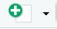
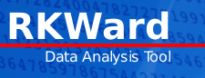

```{r, include=FALSE}
knitr::opts_chunk$set(echo = TRUE,message=F,warning = F)
```


## Open Source Programm R

-  R ist eine freie, nicht-kommerzielle Implementierung der Programmiersprache S (von AT&T Bell Laboratories entwickelt)
- Freie Beteiligung - modularer Aufbau (immer mehr Erweiterungspakete)

- Der Download ist auf dieser Seite möglich:

<https://cran.r-project.org/>


## Graphisches User Interface

Aber die meisten Menschen nutzen einen Editor oder ein graphical user interface (GUI).

Aus den folgenden Gründen:

- Syntax highlighting
- Auto-Vervollständigung
- Bessere Übersicht über Graphiken, Bibliotheken

## Verschiedene GUIs

- [Gedit](https://projects.gnome.org/gedit/) mit R-spezifischen Add-ons für Linux

- [Emacs](http://www.gnu.org/software/emacs/)

- [TinnR](http://www.sciviews.org/Tinn-R/)

- Ich nutze [Rstudio!](https://www.rstudio.com/)


## Wichtige Buttons

  Um ein neues Skript anzulegen.

 Um ein bestehendes Skript zu öffnen

 Zeile in der der Cursor steht evaluieren

 Suchen und Ersetzen

## Alternativen zu Rstudio

### RKward



- Eigenständiges Programm - aus meiner Sicht nicht so praktikabel. 
- Wenn ein umfangreiches Benutzerinterface gewünscht ist würde ich lieber SPSS oder [**PSPP**](https://www.gnu.org/software/pspp/) (freie Version) verwenden.

### Rcommander

- Lässt sich von RStudio aus starten.
- Evtl. geeignet um in R reinzukommen.


## Aufgabe - Vorbereitung

- Prüfen Sie, ob eine Version von R auf Rechner installiert ist.
- Falls dies nicht der Fall ist, laden Sie [R](r-project.org)  runter und installieren Sie R.
- Prüfen Sie, ob Rstudio installiert ist.
- Falls nicht - [Installieren](http://www.rstudio.com/) sie Rstudio.
- Laden Sie die R-Skripte von meinem GitHub-Account
- Erstellen Sie ein erstes Script und finden Sie das Datum mit dem Befehl `date()` und die R-version mit `sessionInfo()` heraus.

```{r}
date()
```

```{r}
sessionInfo()
```


## Links zu Rstudio

- Sechs [**Gründe**](http://www.r-bloggers.com/top-6-reasons-you-need-to-be-using-rstudio/) Rstudio zu nutzen.

- Wie man Rstudio [**nutzen kann.**](https://support.rstudio.com/hc/en-us/sections/200107586-Using-RStudio) - kleine Artikel zu verschiedenen Themen - bspw. Debugging, Paketmanagement oder Shortcuts.

- [**RStudio einrichten**](https://support.rstudio.com/hc/en-us/articles/200549016-Customizing-RStudio) - Im Menü gibt es unter Tools > Optionen eine Reihe von Einstellungen - wozu diese gut sind, wird in diesem Artikel erklärt.  

- [**Einführung in RStudio**](https://dss.princeton.edu/training/RStudio101.pdf) - hier werden die ersten Schritte in RStudio ausführlich erklärt. 
<!--
https://datascienceplus.com/introduction-to-rstudio/
-->

- [**RStudio Cheatsheet**](https://github.com/rstudio/cheatsheets/raw/master/rstudio-ide.pdf) - Übersichtliche Darstellung von Funktionen in RStudio


