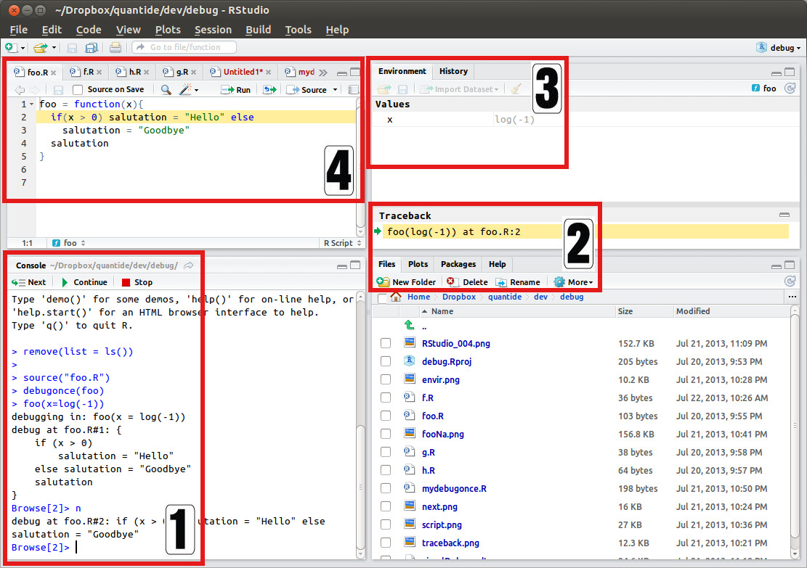
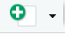
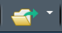
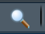
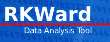
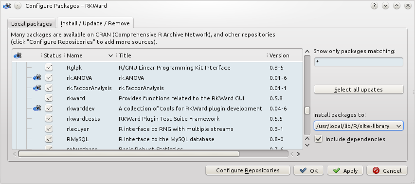
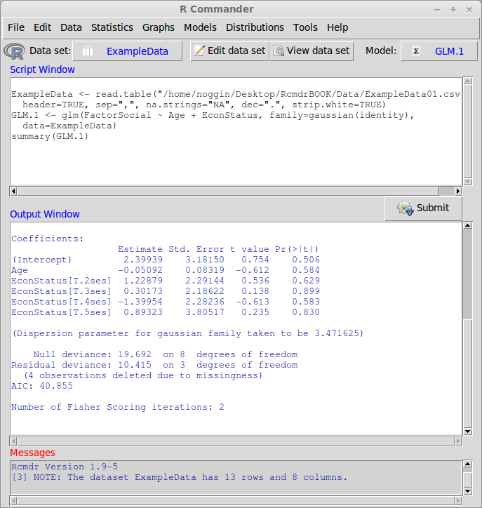

## Open Source Programm R

-  R ist eine freie, nicht-kommerzielle Implementierung der Programmiersprache S (von AT&T Bell Laboratories entwickelt)
- Freie Beteiligung - modularer Aufbau (immer mehr Erweiterungspakete)

- Der Download ist auf dieser Seite möglich:

<https://cran.r-project.org/>


## Graphisches User Interface

Aber die meisten Menschen nutzen einen Editor oder ein Graphisches User Interface (GUI).

Aus den folgenden Gründen:

- Syntax highlighting
- Auto-Vervollständigung
- Bessere Übersicht über Graphiken, Bibliotheken, Hilfeseiten
- Erleichterter Import von Daten
- Unterstützung zur Erstellung von Präsentationen, Postern und Apps

## Verschiedene GUIs

- [**Gedit**](https://projects.gnome.org/gedit/) mit R-spezifischen Add-ons für Linux

- [**Emacs**](http://www.gnu.org/software/emacs/) mit Addin für R - Emacs speaks statistics ([**ESS**](https://ess.r-project.org/))
- [**TinnR**](https://rclickhandbuch.wordpress.com/install-r/tinn-r/) war mal sehr angesagt, wird aber heute kaum noch genutzt. 

- Ich nutze [**Rstudio !**](https://www.rstudio.com/)

{height=70%}


## Wichtige Buttons

  Um ein neues Skript anzulegen.

 Um ein bestehendes Skript zu öffnen

 Zeile in der der Cursor steht evaluieren

 Suchen und Ersetzen

## Alternative zu Rstudio?

### RKward



- Viele Menüfunktionen und Fokus auf statistische Funktionen.
- Aus meiner Sicht nicht so praktikabel. Wenn ein umfangreiches Benutzerinterface gewünscht ist würde ich lieber SPSS oder [**PSPP**](https://www.gnu.org/software/pspp/) (freie Version) verwenden.

## Erweiterung durch Plugins möglich

<!--
- R-Paket `rkwarddev`
-->




## Rcommander

- Lässt sich von RStudio aus starten.
- Evtl. geeignet um in R reinzukommen.



## Aufgabe - Vorbereitung

- Prüfen Sie, ob eine Version von R auf Rechner installiert ist.
- Falls dies nicht der Fall ist, laden Sie [**R**](r-project.org)  runter und installieren Sie R.
- Prüfen Sie, ob Rstudio installiert ist.
- Falls nicht - [Installieren](http://www.rstudio.com/) Sie Rstudio.
- Laden Sie die R-Skripte von meinem GitHub-Account
- Erstellen Sie ein erstes Script und finden Sie das Datum mit dem Befehl `date()` und die R-version mit `sessionInfo()` heraus.


```r
date()
```

```
## [1] "Tue Jun 11 09:42:01 2019"
```


```r
sessionInfo()
```

```
## R version 3.5.1 (2018-07-02)
## Platform: x86_64-w64-mingw32/x64 (64-bit)
## Running under: Windows 7 x64 (build 7601) Service Pack 1
## 
## Matrix products: default
## 
## locale:
## [1] LC_COLLATE=German_Germany.1252  LC_CTYPE=German_Germany.1252   
## [3] LC_MONETARY=German_Germany.1252 LC_NUMERIC=C                   
## [5] LC_TIME=German_Germany.1252    
## 
## attached base packages:
## [1] stats     graphics  grDevices utils     datasets  methods   base     
## 
## loaded via a namespace (and not attached):
##  [1] compiler_3.5.1  magrittr_1.5    tools_3.5.1     htmltools_0.3.6
##  [5] yaml_2.2.0      Rcpp_1.0.1      stringi_1.4.3   rmarkdown_1.12 
##  [9] knitr_1.23      stringr_1.4.0   xfun_0.6        digest_0.6.19  
## [13] evaluate_0.13
```


## Links zu Rstudio

- Sechs [**Gründe**](http://www.r-bloggers.com/top-6-reasons-you-need-to-be-using-rstudio/) Rstudio zu nutzen.

- Wie man Rstudio [**nutzen kann.**](https://support.rstudio.com/hc/en-us/sections/200107586-Using-RStudio) - kleine Artikel zu verschiedenen Themen - bspw. Debugging, Paketmanagement oder Shortcuts.

- [**RStudio einrichten**](https://support.rstudio.com/hc/en-us/articles/200549016-Customizing-RStudio) - Im Menü gibt es unter Tools > Optionen eine Reihe von Einstellungen - wozu diese gut sind, wird in diesem Artikel erklärt.  

- [**Einführung in RStudio**](https://dss.princeton.edu/training/RStudio101.pdf) - hier werden die ersten Schritte in RStudio ausführlich erklärt. 
<!--
https://datascienceplus.com/introduction-to-rstudio/
-->

- [**RStudio Cheatsheet**](https://github.com/rstudio/cheatsheets/raw/master/rstudio-ide.pdf) - Übersichtliche Darstellung von Funktionen in RStudio


