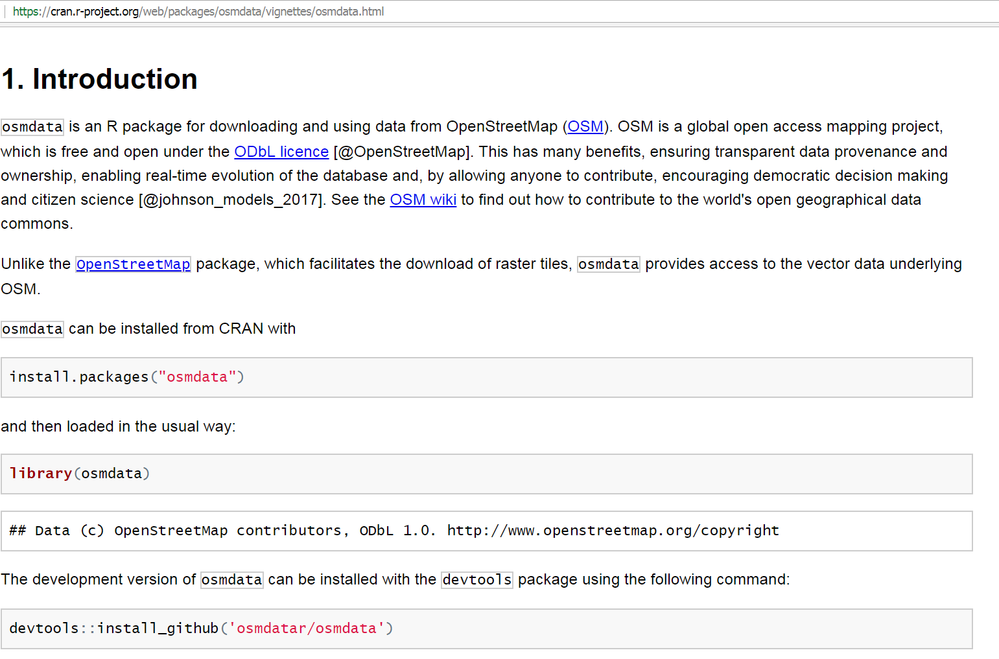
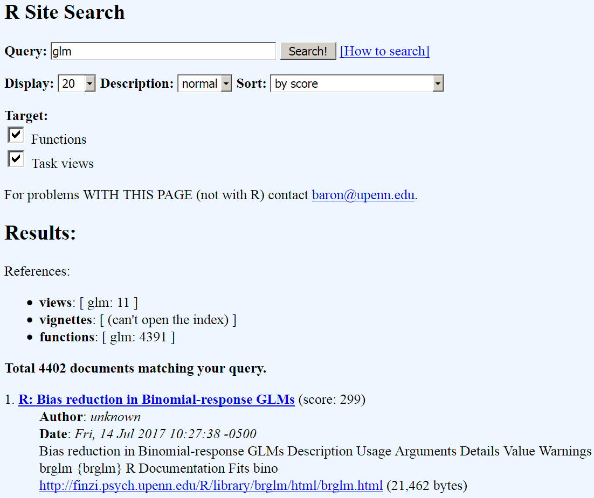

```{r, include=FALSE}
knitr::opts_chunk$set(echo = TRUE)
```


## Wie bekomme ich Hilfe?

-  [**Um Hilfe im Allgemeinen zu bekommen:**](http://itfeature.com/tag/how-to-get-help-in-r)


```{r,eval=F}
help.start()
```

-  [**Online-Dokumentation für die meisten Funktionen:**](https://www.r-project.org/help.html)

```{r,eval=F}
help(name)
```

-  Benutze `?`, um Hilfe zu bekommen 

```{r,eval=F}
?mean
```

-  `example(lm)` liefert ein Beispiel für die lineare Regression 

```{r,eval=F}
example(lm)
```


## Vignetten

- Eine Vignette ist ein Papier, das die wichtigsten Funktionen eines Pakets darstellt. 
- Sie enthalten viele reproduzierbare Beispiele.
- Vignetten sind ein neues Werkzeug, deshalb hat nicht jedes Paket eine Vignette.


```{r,eval=F}
browseVignettes()
```

- Um eine Vignette zu bekommen:

```{r,eval=F}
vignette("osmdata")
```


## Ein Beispiel für eine Vignette - Das Paket `osmdata`



## [**Demos**](http://r-pkgs.had.co.nz/demo.html)

- für manche Pakete gibt es Demos:

```{r,eval=F}
demo() # zeigt alle verfügbaren Demos
demo(package = "httr") # Zeigt alle Demos in einem Paket

# Ein spezifisches Demo laufen lassen:
demo("oauth1-twitter", package = "httr") 
```

- Wenn ein Demo gestartet wird, ist der zugehörige Code in der Konsole sichtbar


```{r,eval=F}
demo(nlm)
```


## [Die Funktion `apropos`](http://www.r-tutor.com/r-introduction)

- findet alles, was den angegebenen String enthält:

```{r}
apropos("nova")
```

- Auch [**reguläre Ausdrücken**](https://de.wikipedia.org/wiki/Regul%C3%A4rer_Ausdruck) können verwendet werden...


```{r,eval=F}
?"regular expression"
```


```{r,eval=F}
help.search("^glm")
```

- `??` ist ein Synonym für `help.search`

## [**Suchmaschine für die R-Seite**](http://search.r-project.org/cgi-bin/namazu.cgi?query=glm&max=20&result=normal&sort=score&idxname=functions&idxname=vignettes&idxname=views)

```{r,eval=F}
RSiteSearch("glm")
```



## Nutzung von Suchmaschinen

-  Ich nutze [**duckduckgo.de:**]()

```
R-project + "was ich schon immer wissen wollte" 
```
-  das funktioniert natürlich für alle Suchmaschinen!


## [**Stackoverflow**](http://stackoverflow.com/)

-  Für alle Fragen zum Programmieren
-  Ist nicht auf R fokussiert - aber es gibt [**viele Diskussionen zu R-Fragen**](https://stackoverflow.com/tags/r/info)
-  Sehr detailierte Diskussionen


## Ein Schummelzettel für Basis R

<https://www.rstudio.com/resources/cheatsheets/>


## Mehr Schummelzettel


## [**Quick R**](http://www.statmethods.net/interface/help.html)

- Viele Beispiele und Hilfe bezüglich eines Themas
- Beispiel: [**Quick R - Getting Help**](http://www.statmethods.net/interface/help.html)


## [Das Paket `swirl`](https://swirlstats.com/)


## Der Start mit `swirl`

```{r,eval=F,echo=F}
install.packages("swirl")
```


```{r}
library(swirl)
```

```{r,eval=F}
swirl()
```


## Weitere Links

- [**Überblick - wie bekommt man Hilfe in R**](https://www.r-project.org/help.html)


- [**Eine Liste mit HowTo`s**](http://rprogramming.net/)

- [**Eine Liste mit den wichtigsten R-Befehlen**](https://www.personality-project.org/r/r.commands.html)

## Aufgabe [**Hilfe bekommen**](http://web.math.ku.dk/~helle/R-intro/exercises.pdf)

### Hilfe für `which.min` 

- Tippe den Befehl `?which.min` in die Konsole. Dies öffnet eine Hilfeseite im unteren rechten Fenster von RStudio. Wofür kann man die Funktion `which.min` nutzen?

- Der Name der Funktion muss bekannt sein, um die Hilfeseite so zu öffnen. Manchmal (oft, sogar) kennen man den Namen der R-Funktionen nicht; dann kann eine [**Suchmaschine**](https://duckduckgo.com/) helfen. Suche bspw. mit den Begriffen `R minimum vector`.

###

- Quelle: - LABORATORY FOR APPLIED STATISTICS: Intro to R - [**Exercises**](http://web.math.ku.dk/~helle/R-intro/exercises.pdf) 


