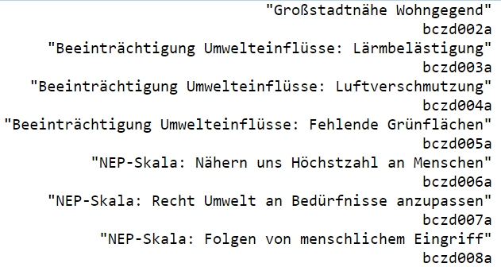
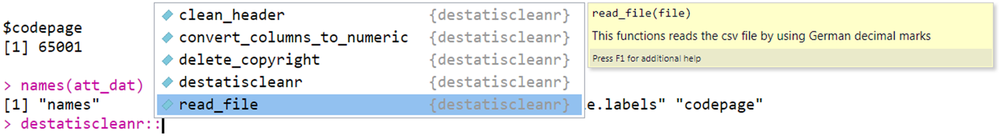

```{r setup, include=FALSE}
knitr::opts_chunk$set(echo = T)
```


## [Pakete automatisch installieren](https://stackoverflow.com/questions/4090169/elegant-way-to-check-for-missing-packages-and-install-them)

```{r,echo=F}
my_packages <- installed.packages()
mypack <- my_packages[,"Package"]
```


<!--

-->

- Mit `installed.packages()` kann ich herausfinden, welche Pakete installiert sind.
- Bei mir sind es momentan `r length(mypack)` Pakete.

```{r,eval=F}
my_packages <- installed.packages()
mypack <- my_packages[,"Package"]
```

```{r}
my_packages[,"Package"]
```


## Fehlende Pakete installieren

- Zunächst wird eine Liste (bspw. `packlist`) mit den benötigten Paketen erstellt.
- Dann wird geprüft ob diese Pakete unter den installierten Paketen sind.
- Zuletzt werden Pakete installiert, die noch nicht vorhanden sind. 

```{r,eval=F}
packlist <- c("ggplot2", "Rcpp")
new.packages <- packlist[!(packlist %in% mypack)]
if(length(new.packages)) install.packages(new.packages)
```


## [Codeblöcke zusammenklappen](https://support.rstudio.com/hc/en-us/articles/200484568-Code-Folding-and-Sections)


<!--
##
https://support.rstudio.com/hc/en-us/articles/204463668-Code-Snippets
-->

## Die Funktion `source`

- Wenn das Argument `echo=T` gesetzt ist, sieht man auch was innerhalb des Skripts passiert. 
- Die Funktion eignet sich, bspw. wenn immer wieder die gleichen Arbeitsschritte durchgeführt werden, die selten verändert werden müssen. 

```{r,eval=F}
source("../rcode/load_packages.R",echo=T)
```

## [Snippets - für einen automatischen Header](https://stackoverflow.com/questions/40616132/create-a-default-comment-header-template-in-r)

Tools > Golbal Options


<!--
r-project + create automatic header for Scriptfiles
-->


## [Shapefiles herunterladen](http://www.offenedaten.frankfurt.de/dataset/frankfurter-stadtteilgrenzen-fur-gis-systeme)


## Shapefiles importieren

```{r}
ffm_shp <- rgdal::readOGR(
  "../data/Stadtteile_Frankfurt_am_Main.shp")
```

## Der Datenslot 

```{r}
head(ffm_shp@data)
```

## Inhaltliche Daten hinzufügen

- Voraussetzung: in beiden Datensätzen befinden sich die Stadtteile in der gleichen Ordnung.

```{r}
dat <- read.csv2("../data/bauenwohnen.csv")
ffm_shp@data$Einwohnerdichte <- 
dat$Wohnumfeld...öffentlicher.Raum.Einwohnerdichte.je.ha.2012
```

## Eine thematische Karte plotten

```{r}
sp::spplot(ffm_shp,"Einwohnerdichte")
```

## Eine andere Farbpalette

```{r}
sp::spplot(ffm_shp,"Einwohnerdichte",col.regions=colorRampPalette(c('dark red','white','dark blue'))
```


## Thematische Karte mit `tmap`

```{r,eval=F,echo=F}
install.packages("tmap")
```


```{r}
tmap::qtm(ffm_shp,"Einwohnerdichte")
```


## Die Daten matchen

- Indikatoren matchen und hoffen, dass keine NA`s auftauchen.

```{r}
ind <- match(ffm_shp$STTLNAME,dat$Stadtteil)
ind
```

## Wo hakt es?

```{r}
dat_ffm <- data.frame(ffm_shp$STTLNAME,dat$Stadtteil)
dat_ffm[is.na(ind),]
```

## Werte manuell zuordnen

```{r}
ffm_shp$STTLNAME[which(is.na(ind))]
nas1 <- ffm_shp$STTLNAME[which(is.na(ind))][1]
agrep(nas1,dat$Stadtteil)
ind[which(is.na(ind))[1]] <- agrep(nas1,dat$Stadtteil)
```


## Belabelter SPSS Datensatz

```{r,eval=F}
data_path <- "D:/gitlab/IntroDataAnalysis/data/"
gpdat <- foreign::read.spss(paste0(data_path,
            "ZA5666_v1-0-0.sav"),to.data.frame=TRUE)
att_dat <- attributes(gpdat)
names(att_dat)
```

```
## "names"           "class"           "row.names"       "variable.labels" "codepage"
```

## Die Variablenlabels

```{r,eval=F}
att_dat$variable.labels
```




```{r,eval=F,echo=F}
gpdat <- haven::read_sav(paste0(data_path,"ZA5666_v1-0-0.sav"))
```

<!--
## Boxplot mit Ausreißern


```{r}
y <- c(rnorm(99),20)
boxplot(y)
boxplot(y,range=2)
```
-->

<!--
https://www.r-statistics.com/tag/boxplot-outlier/
-->
  

## Destatis Daten

- Für die Nutzung der API ist vermutlich das `httr` Paket hilfreich

```{r,eval=F}
install.packages("httr")
```


```{r,eval=F}
devtools::install_github("cutterkom/destatiscleanr")
```

```{r}
library(destatiscleanr)
```



<!--
https://cran.r-project.org/web/packages/request/README.html
-->
