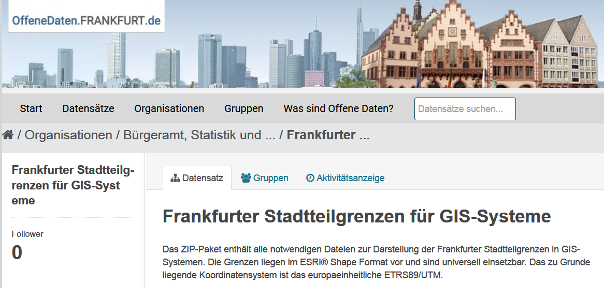

```{r setup, include=FALSE}
knitr::opts_chunk$set(echo = FALSE)
```

<!--

-->

## [Pakete automatisch installieren](https://stackoverflow.com/questions/4090169/elegant-way-to-check-for-missing-packages-and-install-them)

```{r}
my_packages <- installed.packages()
mypack <- my_packages[,"Package"]
head(my_packages[,"Package"])
```

## Fehlende Pakete installieren

```{r,eval=F}
packlist <- c("ggplot2", "Rcpp")
new.packages <- packlist[!(packlist %in% mypack)]
if(length(new.packages)) install.packages(new.packages)
```


## [Codeblöcke zusammenklappen](https://support.rstudio.com/hc/en-us/articles/200484568-Code-Folding-and-Sections)


<!--
##
https://support.rstudio.com/hc/en-us/articles/204463668-Code-Snippets
-->

## Die Funktion `source`

```{r,eval=F}
source("../rcode/load_packages.R")
```

## [Snippets - um automatisch Codekopf einzufügen](https://stackoverflow.com/questions/40616132/create-a-default-comment-header-template-in-r)

Tools > Golbal Options


## Destatis Daten

```{r,eval=F}
devtools::install_github("cutterkom/destatiscleanr")
```

```{r}
library(destatiscleanr)
```


<!--
r-project + create automatic header for Scriptfiles
-->


## [Shapefiles herunterladen](http://www.offenedaten.frankfurt.de/dataset/frankfurter-stadtteilgrenzen-fur-gis-systeme)



## Shapefiles importieren

```{r}
ffm_shp <- rgdal::readOGR("../data/Stadtteile_Frankfurt_am_Main.shp")
```

## Der Datenslot 

```{r}
head(ffm_shp@data)
```

## Inhaltliche Daten hinzufügen

```{r}
dat <- read.csv2("../data/bauenwohnen.csv")
ffm_shp@data$Einwohnerdichte <- 
  dat$Wohnumfeld...öffentlicher.Raum.Einwohnerdichte.je.ha.2012
```

## Eine thematische Karte plotten

```{r}
sp::spplot(ffm_shp,"Einwohnerdichte")
```

