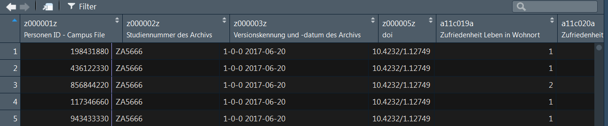

```{r, include=FALSE}
knitr::opts_chunk$set(echo = TRUE,message=F,warning=F)
```


## Datenimport


## Daten mit RStudio importieren

### RStudio Funktionalität um Daten zu importieren

- Environment - Import Dataset - Filetyp auswählen


## Wo findet man die Daten?

### Browse Button in RStudio
<!--
- You have a Browse Button in RStudio
-->


### Code Vorschau in Rstudio

<!--
- Here you can copy the code
-->


## `.txt` importieren

```{r}
dat_gc <- read.table("../data/datt_gc_ffm.txt")
```

```{r}
head(dat_gc)
```


## `csv` Daten importieren

- `read.csv` ist ein Befehl, der im Basispaket verfügbar ist.
- Excel-Daten können als `.csv` in Excel gespeichert werden.
- Dann kann `read.csv()` zum Einlesen der Daten verwendet werden.
- Für Deutsche Daten benötigt man eventuell `read.csv2()` wegen der Komma-Trennung.

<!--
```{r,eval=F}
?read.csv
?read.csv2
```
-->

```{r,eval=F}
dat <- read.csv("../data/ZA5666_v1-0-0.csv")
```

Wenn es Deutsche Daten sind:

```{r,eval=F}
datd <- read.csv2("../data/ZA5666_v1-0-0.csv")
```


```{r,echo=F,eval=F}
datd <- datd[1:10,1:4]
save(datd,file="../data/ZA5666_v1-0-0_small.RData")
```


## Excel-Datensatz importieren - mit `xlsx`.

###  Paket `xlsx`

- Titel: Read, Write, Format Excel 2007 and Excel 97/2000/XP/2003 Files
- Autoren: Adrian A. Dragulescu, Cole Arendt

```{r,eval=F}
install.packages("xlsx")
```


```{r,eval=F}
library("xlsx")
ab_xlsx <- read.xlsx("../data/ab.xlsx",1)
```

- Das Paket `xlsx` benötigt Java - wenn das nicht verfügbar ist, verwenden Sie den Befehl `read_excel` aus dem Paket `readxl`.

## Das Paket `readxl`

```{r,eval=F}
install.packages("readxl")
```

- [**`readxl` hat keine externen Abhängigkeiten**](https://stackoverflow.com/questions/7049272/importing-excel-files-into-r-xlsx-or-xls)
- `readxl` unterstützt sowohl das alte `.xls` Format als auch das moderne xml-basierte `.xlsx` Format.

```{r,eval=F}
library(readxl)
ab <- read_excel("../data/ab.xlsx")
head(ab)
```


## SPSS Dateien einlesen

Dateien können auch direkt aus dem Internet geladen werden:

```{r,eval=F}
link<- "http://www.statistik.at/web_de/static/
mz_2013_sds_-_datensatz_080469.sav"

?read.spss
Dat <- read.spss(link,to.data.frame=T)
```

## Importieren von `stata` Dateien

- Mit `read.dta13` können Stata-Dateien ab Version 13 (und höher) importiert werden.

```{r,eval=F}
library(readstata13)
dstat<-read.dta13("../data/ZA5666_v1-0-0_Stata14.dta")
```


### Import von `stata` Dateien - ältere Versionen

```{r,eval=F}
library(foreign)
dst12 <- read.dta("../data/ZA5666_v1-0-0_Stata12.dta")
```

- Einführung in den Import mit R ([**is.R**](http://is-r.tumblr.com/post/37181850668/reading-writing-stata-dta-files-with-foreign))


## Die Bibliothek `readstata13`


## [**Die Bibliothek `rio`**](https://cran.r-project.org/web/packages/rio/vignettes/rio.html)

```{r,eval=F}
install.packages("rio")
```

```{r,eval=F}
library("rio")
x <- import("../data/ZA5666_v1-0-0.csv")
y <- import("../data/ZA5666_v1-0-0_Stata12.dta")
z <- import("../data/ZA5666_v1-0-0_Stata14.dta")
```

- [**rio: Ein Schweizer Offiziersmesser für Data I/O**](https://cran.r-project.org/web/packages/rio/README.html)

## Sich einen ersten Überblick verschaffen 

```{r,eval=F}
View(datf)
```



- Das gleiche kann man mit RStudio erreichen, wenn man auf das Datensatzsymbol im Umgebungsmenü klicken.


<!--
## Data management oriented to SPSS or Stata

```{r,eval=F}
install.packages("Rz")
library(Rz)
```
-->


## Das Arbeitsverzeichnis


## ...

- Wenn sich die Daten auf einem anderen Laufwerk in Windows befinden


<!--
- search directory:


-->


## Eingebaute Datensätze

- Häufig wird ein Beispieldatensatz zur Verfügung gestellt, um die Funktionalität eines Pakets zu zeigen.
- Diese Datensätze können mit dem Befehl `data` geladen werden.

```{r}
data(iris)
```


- Es gibt auch ein [**RStudio-Add-In**](https://github.com/bquast/datasets.load), das hilft, einen Datensatz zu finden.

```{r,eval=F}
install.packages("datasets.load")
```


## Exkurs [RStudio Addins](https://cran.r-project.org/web/packages/addinslist/README.html)

- Oben rechts befindet sich ein Button Addins 


## [**Daten einfügen**](https://github.com/lbusett/insert_table)

- [**RStudio Addin um Daten einzufügen**](https://github.com/lbusett/insert_table)

```{r,eval=F}
devtools::install_github("lbusett/insert_table")
```

{ height=50% }


## Offene Daten der Stadt Frankfurt am Main


##  Übung - Importieren von Daten

- Importieren Sie die `.xls` Datei zum Wohnumfeld ([**Link**](http://offenedaten.frankfurt.de/dataset/bauen-wohnen/resource/a4ecd696-45f0-4f4a-90c3-bb788beca8e5)) und verschaffen Sie Sich einen ersten Überblick über die Daten. 

