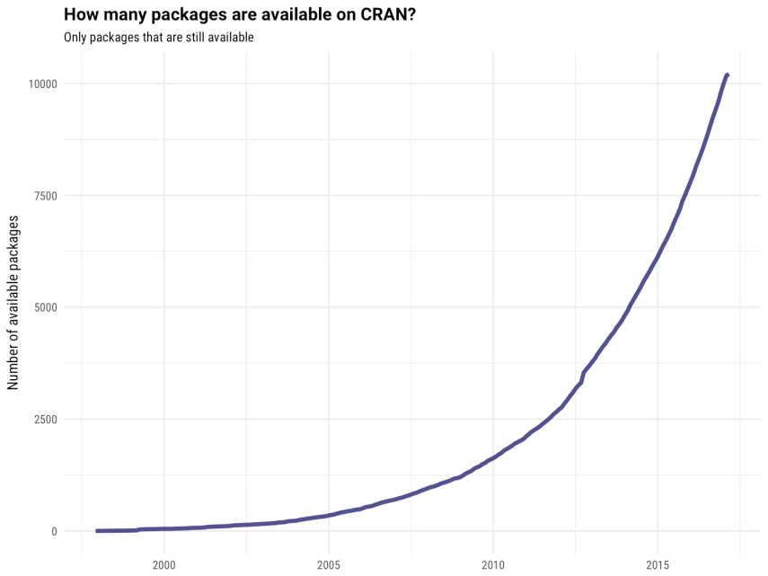
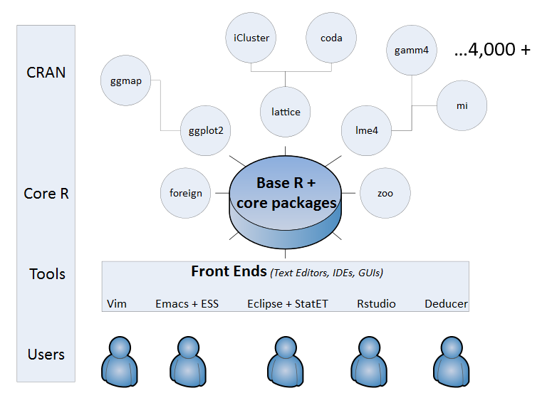
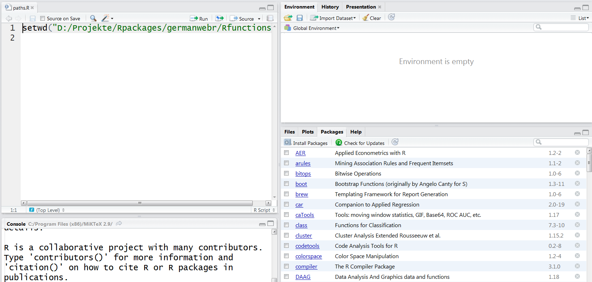

## [**Wo man Routinen findet**](https://stats.idre.ucla.edu/r/seminars/intro/)


- Viele Funktionen sind in Basis-R enthalten. 
- Spezifische Funktionen sind in zusätzlichen Paketen integriert.
- R kann modular durch sogenannte Pakete oder Bibliotheken erweitert werden.
- Die wichtigsten Pakete werden auf CRAN gehostet (14289 Pakete am 11 Juni 2019)
<!--
https://www.statmethods.net/input/dates.html
-->
- Weitere Pakete findet man z.B. unter [**bioconductor**](www.bioconductor.org)

## [Entwicklung - Zahl der R-Pakete](https://www.r-bloggers.com/scraping-cran-with-rvest/)

{height=80%}


## Übersicht R-Pakete

<!--
https://sebastiansauer.github.io/figure_sizing_knitr/
-->

{ height=50% }

## Installation von Paketen

- Die Anführungszeichen um den Paketnamen herum sind für den Befehl `install.packages` notwendig.
- Sie sind optional für den Befehl `library`.
- Man kann auch `require` anstelle von `library` verwenden.


```r
install.packages("lme4")

library(lme4)
```

## Installation von Paketen mit RStudio




## Bestehende Pakete und Installation


## Übersicht über viele nützliche Pakete:

- Luhmann - [**Tabelle mit vielen nützlichen Paketen**](http://www.beltz.de/fileadmin/beltz/downloads/OnlinematerialienPVU/28090_Luhmann/Verwendete%20Pakete.pdf)

### Weitere interessante Pakete:

- Pakete für den Import/Export - [**`foreign`**](http://cran.r-project.org/web/packages/foreign/foreign.pdf), [**`rio`**](https://cran.r-project.org/web/packages/rio/vignettes/rio.html), [**`readstata13`**](https://cran.r-project.org/web/packages/readstata13/readme/README.html)

- [**`sampling`-Paket für die Stichprobenziehung**](http://iase-web.org/documents/papers/icots8/ICOTS8_4J1_TILLE.pdf)

- `xtable` Paket zur Integration von LateX in R ([**xtable Galerie**](http://cran.r-project.org/web/packages/xtable/vignettes/xtableGallery.pdf))

- [**`dummies` - Paket zur Erstellung von Dummies**](http://cran.r-project.org/web/packages/dummies/dummies.pdf)

- [**Paket `mvtnorm` um eine multivariate Normalverteilung zu erhalten. **](http://cran.r-project.org/web/packages/mvtnorm/index.html)

- Pakete [**`maptools`**](http://www.r-bloggers.com/tag/maptools/), [**`sf`**](https://cran.r-project.org/web/packages/sf/vignettes/sf1.html) und [**`leaflet`**](https://rstudio.github.io/leaflet/) um mit geografischen Daten zu arbeiten und (interaktive) Karten zu erzeugen


## Installation R-Pakete - Quellen

### Pakete vom CRAN Server installieren


```r
install.packages("lme4")
```

### Pakete vom Bioconductor Server installieren


```r
source("https://bioconductor.org/biocLite.R")
biocLite(c("GenomicFeatures", "AnnotationDbi"))
```

### Pakete von Github installieren


```r
install.packages("devtools")
library(devtools)
install_github("hadley/ggplot2")
```


## Rcommander


```r
install.packages("Rcmdr")
```


```r
library(Rcmdr)
```

<!--
swirl
-->


## Wie bekomme ich einen Überblick?

- Entdecke Pakete, die kürzlich auf den [**CRAN**](https://mran.microsoft.com/packages/) Server hochgeladen wurden

- Nutze eine Shiny Web-App, die [**Pakete anzeigt, die kürzlich von CRAN**](https://gallery.shinyapps.io/cran-gauge/) heruntergeladen wurden.

- Werfe einen Blick auf eine [**Quick-Liste nützlicher Pakete**](https://support.rstudio.com/hc/en-us/articles/201057987-Quick-list-of-useful-R-packages)

- eine Liste mit den [**besten Paketen für die Datenverarbeitung und -analyse**](http://www.computerworld.com/article/2921176/business-intelligence/great-r-packages-for-data-import-wrangling-visualization.html)

- [**die 50 meistgenutzten Pakete**](https://www.r-bloggers.com/the-50-most-used-r-packages/)


## CRAN Task Views		
		
- Bezüglich mancher Themen gibt es einen Überblick über alle wichtigen Pakete - ([**CRAN Task Views**](https://cran.r-project.org/web/views/))
- Momentan gibt es 40 Task Views.
- Alle Pakete einer Task-View können mit folgendem [**Befehl**](https://mran.microsoft.com/rpackages/) installiert werden: 


```r
install.packages("ctv")
library("ctv")
install.views("Bayesian")
```


## Aufgabe - Zusatzpakete

Gehe bspw. auf <https://cran.r-project.org/> (oder auf andere Seiten) und suche nach Paketen,...

-  um Daten zu visualisieren
-  um Daten zu manipulieren 
- für die Modellierung (bspw. Regressionen)
-  um Ergebnisse zu berichten (bspw. in einem pdf oder auf einer Website)
