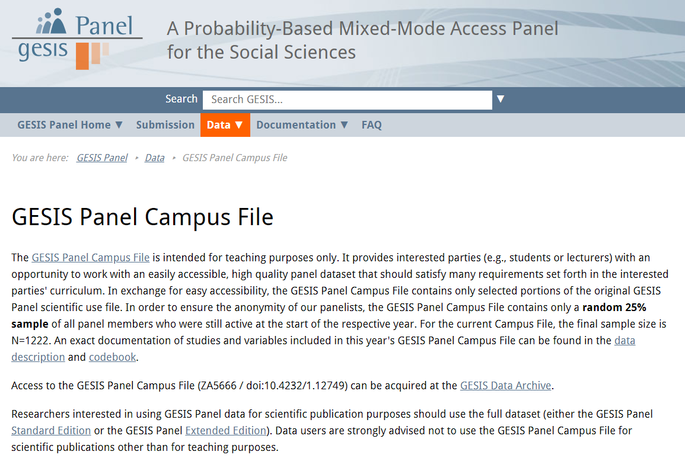
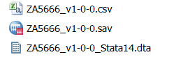

```{r, include=FALSE}
knitr::opts_chunk$set(echo = T,warning=F,message=F)
library(knitr)
# library(kableExtra)
```

## Beispiel Schleifen

### Motivation

- Im Prinzip sollte man immer versuchen Aufgaben zu vektorisieren (`apply` Befehlsfamilie).
- Allerdings können Schleifen auch sehr nützlich sein. 
- Um dies zu zeigen, möchte ich etwas länger ausholen...

### Arbeitsschritte

- Beispieldaten laden
- Geokodierung durchführen.
- Schleifen schreiben und anwenden.

## Daten laden

```{r}
load("../data/bauenwohnen_teil.RData")
```

```{r}
head(dat$Stadtteil)
```

## Eine Spalte hinzufügen

```{r}
(dat$stadtteil_l <- paste("Frankfurt",dat$Stadtteil))
```

## Geokodieren

```{r}
library(tmaptools)
```

```{r,eval=F}
(gc1 <- geocode_OSM("Frankfurt Altstadt"))
```

```
$`query`
[1] "Frankfurt Altstadt"

$coords
        x         y 
 8.682936 50.111045 

$bbox
     xmin      ymin      xmax      ymax 
 8.674523 50.106129  8.688171 50.114872 
```

## Mehr Informationen

```{r,eval=F}
gc2 <- geocode_OSM("Frankfurt Altstadt",details = T)
```

```{r,eval=F,echo=F}
save(gc2,file="../data/ffm_gc2.RData")
```

```{r,echo=F}
load("../data/ffm_gc2.RData")
```

```{r}
names(gc2)
```


## [**Schleifen in R**](https://www.datacamp.com/community/tutorials/tutorial-on-loops-in-r)

- Der Befehl `for()` kennzeichnet den Start einer Schleife 
- in Klammern, haben wir einen Index und die Anzahl der Läufe (in diesem Fall läuft die Schleife von 1 bis 4).
- in den geschweiften Klammern `{}` ist angegeben, was bei einer Iteration passiert.

```{r,eval=T}
for (i in 1:4){
  cat(i, "\n")
}
```

## Schleifen - die Ergebnisse behalten

- Wir können die Ergebnisse in einem Objekt speichern
- dieses kann bspw. ein Vektor oder eine Liste sein. 

```{r,eval=F}
erg <- list()

for (i in 1:ncol(dat)){
  erg[[i]] <- summary(dat)
  cat(i, "\n")
}
```


```{r,eval=F,echo=F}
## Funktionen in R
getgeocode <- function(gc_object){
  x <- gc_object$coords
  return(x)
}
```


## Eine Schleife um die geokodierten Ergebnisse abzugreifen

- Die Geokdoierung wird durchgeführt und das Ergebnis an der entsprechenden Stelle in der Liste `erg` gespeichert. 

```{r,eval=F}
erg <- list()
for(i in 1:nrow(dat)){
  erg[[i]] <- geocode_OSM(dat$stadtteil_l[i])
}
```

```{r,eval=F,echo=F}
save(erg,file="../data/gc_list_stadtteile_ffm.RData")
```

```{r,echo=F}
load("../data/gc_list_stadtteile_ffm.RData")
```

```{r}
erg2 <- lapply(erg,function(x)x$coords)
df_gc1 <- do.call(rbind,erg2)
df_gc <- data.frame(dat$Stadtteil,df_gc1)
```

## Das resultierende `data.frame`

```{r}
head(df_gc)
```

<!--
## [Funktionen in R](https://swcarpentry.github.io/r-novice-inflammation/02-func-R/)
-->

## Alle R-Dateien in einem Ordner

```{r}
dirn <- dir("../data/")
head(dirn)
grep(".RData",dirn)
head(rdat <- grep(".RData",dirn,value = T))
```

## Diese Dateien einlesen

```{r,eval=F}
for (i in 1:length(rdat)){
  load(rdat[i])
  cat(rdat[i],"\n")
}
```


## Beispiel Funktionen

### Motivation

- Funktionen können sehr nützlich sein, bspw. um sich eine Menge Schreibarbeit zu ersparen. - Später kann man sich ganz individuelle Lösungen bauen 

### Arbeitsschritte

Im GESIS Panel sind fehlende Werte mit Minuswerten kosiert. Diese sollten durch das Systemmissing von R ersetzt werden um korrekte Berechnungen (bspw. Mittelwert) zu ermöglichen.

- Beispieldaten laden
- Fehlende Werte ersetzen
- Funktion schreiben und anwenden


## Das GESIS Panel 

- Wahrscheinlichkeitsbasiertes  Access Panel für Individuen: - Allgemeine Bevölkerung in Deutschland, Deutschsprachhige Bevölkerung, 18-70 Jahre
- Panelisten wurden aus den Melderegistern rekrutiert  - (270 Sampling Points) 
7599 face-to-face Interviews (CAPI)
- Ungefähr 5000 Panelisten (Basis Stichprobe / erste Kohorte 2014)

## Das GESIS Panel Campus File



## Die Daten herunterladen

- Übersichtsseite: [**GESIS Panel Campus File**](https://www.gesis.org/gesis-panel/data/gesis-panel-campus-file/)
- Registrierung notwendig


### Links für den Download:

- [**Download `.csv`**](https://dbk.gesis.org/dbksearch/download.asp?db=D&id=62367)
- [**Download `.sav`**](https://dbk.gesis.org/dbksearch/download.asp?db=D&id=62369)
- [**Download `**14.dta`**](https://dbk.gesis.org/dbksearch/download.asp?db=D&id=62371)




## Datensatz importieren

```{r}
load("../data/gp_small.RData")
head(dats)
```


## Die Missing Codes im GESIS Panel

<!--

-->


```{r,echo=F}
misscodes <- c(-11,-22,-33,-44,-55,-66,-77,-88,-99,-111)
missvallab <- c("Not invited","Not in panel","Unit nonresponse","Missing by m.o.p.","Missing by technical error","Missing by design","Not reached","Missing by filter","Item nonresponse","Ambiguous answer")
missremark <- c("only in recruitment waves as long as the respective profile survey is not yet finished","not willing to join the panel after recruitment interview or actively signing off the panel","invited but not participating in corresponding wave","mode of participation (m.o.p.): online or offline","e.g. questionnaire programming error","experimental variation","only in online mode: panelist has not seen the item","filtered item","due to nonresponse by the respondent","ambiguous answers in questionnaire")

missremark2 <- c("only in recruitment waves - when profile survey not finished","not willing to join the panel after recruitment or signing off","invited but not participating in corresponding wave","mode of participation (m.o.p.): online or offline","e.g. questionnaire programming error","experimental variation","only in online mode: panelist has not seen the item","filtered item","due to nonresponse by the respondent","ambiguous answers in questionnaire")

df <- data.frame(Value=misscodes,"Value label"=missvallab,Remark=missremark2)
```

```{r,eval=T}
kable(df,row.names = F) 
```

```{r,eval=F}
df %>% regulartable() %>% autofit() %>% 
width(j=~Value,width=1) %>% width(j=~Value.label,width=1)%>% width(j=~Remark,width=1)
```


## Fehlende Werte ersetzen

```{r}
mean(dats$a11d056z)
```

```{r}
dats$a11d056z[dats$a11d056z==-99] <- NA
mean(dats$a11d056z)
mean(dats$a11d056z,na.rm=T)
```

## Eine Funktion um die fehlenden Werte zu ersetzen

```{r,eval=F,echo=F}
code_miss <- function(var){
  misvals <- c(-11,-22,-33,-44,-55,-66,-77,-88,-99,-111)
  var[var %in% misvals] <- NA
  return(var)
}

```

```{r}
code_miss <- function(var){
  var[var==-99] <- NA
  return(var)
}
```

## Aufgabe - Funktion erweitern

- Laden Sie den synthetischen Datensatz des GESIS Panels von Github herunter und importieren Sie ihn in R.
- Erweitern Sie die Funktion auf der vorhergehenden Folie so, dass auch die anderen fehlenden Werte durch `NA` ersetzt werden. 
- Wenden Sie die Funktion auf den ganzen Datensatz an und ersetzen Sie alle fehlenden Werte mit `NA`