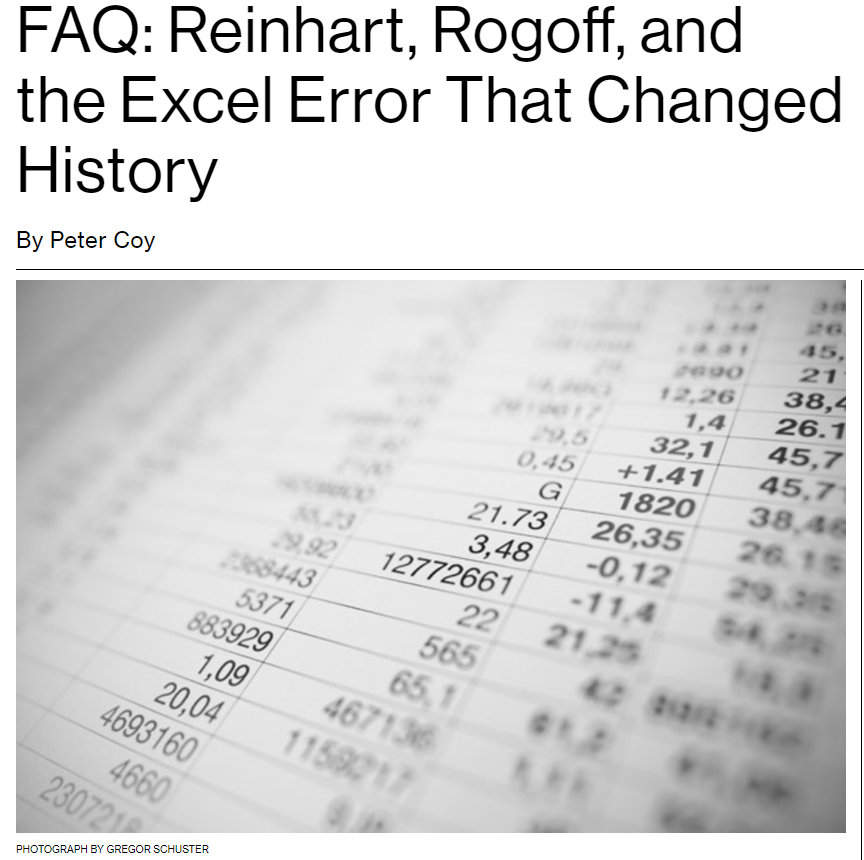
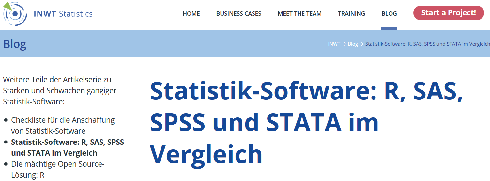

```{r, include=FALSE}
knitr::opts_chunk$set(echo = TRUE,message=F,warning = F)
```

## Um rein zu kommen

### Kleine Vorstellungsrunde

- Wo kommt Ihr her?
- Wo arbeitet und studiert Ihr?
- Habt Ihr Erfahrungen mit Programmiersprachen / Statistiksoftware? Wenn ja welche?
- Was sind Eure Erwartungen für diesen Kurs? 

## Disclaimer/ Informationen vorab

Normalerweise gibt es große Unterschiede bei Vorkenntnissen und Fähigkeiten - bitte gebt Bescheid, wenn es zu schnell oder zu langsam geht oder etwas unklar geblieben ist.

- Wenn es Fragen gibt - immer fragen
- In diesem Kurs gibt es viele [**Übungen**](http://web.math.ku.dk/~helle/R-intro/exercises.pdf), denn das Programmieren / die Nutzung von R lernt man am Ende nur allein.
- Ich habe viele [**Beispiele**](https://www.showmeshiny.com/) - probiert sie aus 
- R macht mehr Spaß zusammen - arbeitet zusammen!


## Unterlagen zu diesem Kurs

- Die Foliensätze sind komplett auf github zu finden:

https://github.com/Japhilko/IntroR/tree/master/2019

- Die Unterlagen werden dort auch verfügbar bleiben
- Wer möchte, kann den Foliensatz ausgedruckt bekommen?


## Erwartungen und Anforderungen

### Das kann diese Schulung vermitteln:

- Eine praxisnahe Einführung in die statistische
Programmiersprache R
- Erlernen einer Programmier-Strategie
- Guten Stil
- Die Vorzüge graphischer Datenanalyse

### Das kann sie nicht leisten:

-  Eine Einführungsveranstaltung in die Statistik geben
-  Grundlegende datenanalytische Konzepte vermitteln
-  Verständnis zementieren
-  Das Trainieren abnehmen


## Gründe R zu nutzen...


<!--
Outstanding Graphs
-->

- ... R ist eine [**quelloffene Sprache**](https://stackoverflow.com/questions/1546583/what-is-the-definition-of-an-open-source-programming-language)

- ... hervorragende [**Grafiken**](http://matthewlincoln.net/2014/12/20/adjacency-matrix-plots-with-r-and-ggplot2.html), [**Grafiken**](https://www.r-bloggers.com/3d-plots-with-ggplot2-and-plotly /), [**Grafiken**](https://procomun.wordpress.com/2011/03/18/splomr/)

- ... [**R kann in Kombination mit anderen Programmen verwendet werden**](https://github.com/Japhilko/RInterfaces) - z.B. zur [**Verknüpfung von Daten**](https://github.com/Japhilko/RInterfaces/blob/master/slides/Datenimport.md)

- ... R kann [**zur Automatisierung**](https://cran.r-project.org/web/packages/MplusAutomation/index.html) verwendet werden

 - ... Breite und aktive Community - [**Man kann die Intelligenz anderer Leute nutzen ;-)**](https://www.r-bloggers.com/)


<!--
## Gründe

- R ist [frei verfügbar](http://www.inside-r.org/why-use-r). Es kann umsonst [runtergeladen](http://mirrors.softliste.de/cran/) werden.
- R ist eine [Skriptsprache](https://de.wikipedia.org/wiki/Skriptsprache)
- Gute Möglichkeiten für die [Visualisierung](http://research.stowers-institute.org/efg/R/) ([Link](http://www.sr.bham.ac.uk/~ajrs/R/r-gallery.html) )
- R wird immer [populärer](https://twitter.com/josiahjdavis/status/559778930476220418)
- [Popularität von R](http://blog.revolutionanalytics.com/popularity/)


## Übersicht - warum R


-->


## R kann in Kombination mit anderen Programmen genutzt werden... 


- Schnittstelle zu: [**Python**](https://cran.r-project.org/web/packages/reticulate/vignettes/calling_python.html), [**Excel**](https://www.springer.com/de/book/9781441900517), [**SPSS**](https://www.ibm.com/support/knowledgecenter/en/SSFUEU_7.2.0/com.ibm.swg.ba.cognos.op_capmod_ig.7.2.0.doc/t_essentials_for_r_statistics.html), [**SAS**](https://cran.r-project.org/web/packages/SASmixed/index.html), [**Stata**](https://cran.r-project.org/web/packages/RStata/index.html)  


## [Die Popularität von R](https://gallery.shinyapps.io/cran-gauge/)


<!--
## [R Nutzer rund um die Welt](http://revolution-computing.typepad.com/)


-->

<!--
## [Wo sind die aktivsten Nutzer?](http://spatial.ly/)


-->


## [R Nutzung ...](https://www.bloomberg.com/news/articles/2013-04-18/faq-reinhart-rogoff-and-the-excel-error-that-changed-history)


### Weil [**andere Programme**](https://www.bloomberg.com/news/articles/2013-04-18/faq-reinhart-rogoff-and-the-excel-error-that-changed-history) Fehler provozieren können:

<!--
### Wegen Fehleranfälligkeit anderer Programme

-->

- [Reinhart/Rogoff Paper](https://www.bloomberg.com/news/articles/2013-04-18/faq-reinhart-rogoff-and-the-excel-error-that-changed-history) - [**Star-Ökonom beklagt Hexenjagd nach Excel-Panne**](https://www.spiegel.de/wirtschaft/soziales/excel-panne-von-kenneth-rogoff-das-war-ein-massaker-a-929248.html)


<!--
Weil andere Programme große Fehler haben:
-->

- [**Probleme mit der Rundung bei Excel**](https://www.quora.com/What-are-some-horrible-bugs-in-MS-Excel)


- [**Große Verluste an Börse könnten 2012 durch Excel Fehler verursacht worden sein**](http://blog.revolutionanalytics.com/2013/02/did-an-excel-error-bring-down-the-london-whale.html)

- [**Probleme mit den Datumsangaben in Excel**](https://coffeehouse.dataone.org/2014/04/09/abandon-all-hope-ye-who-enter-dates-in-excel/)

<!--

-->


- [**Probleme mit Excel bei der Nutzung in Bioinformatik Anwendung**](http://www.biomedcentral.com/1471-2105/5/80)

<!--

-->


## R herunterladen:

<http://www.r-project.org/>


## Links


- R-bloggers - [**Warum man R für Data Science lernen sollte?**](http://www.r-bloggers.com/why-you-should-learn-r-first-for-data-science/)

- R-bloggers - [**R Technologie des Jahres**](http://www.r-bloggers.com/rstudio-infoworld-2015-technology-of-the-year-award-recipient/)

- R-bloggers - [**Warum man R nutzen sollte**](http://www.r-bloggers.com/why-use-r/)

- [**Warum die Nutzung von R gut für das Geschäft ist?**](http://www.fastcolabs.com/3030063/why-the-r-programming-language-is-good-for-business) 

- [**Vergleich zwischen Python und R**](http://www.dataschool.io/python-or-r-for-data-science/)


### Einführungen in R

- [**Intro R**](http://www.ats.ucla.edu/stat/r/seminars/intro.htm) - Kurs der UCLA

- [**Intro R**](http://www.ats.ucla.edu/stat/r/sk/) - Zweiter Teil des Kurses


## [Vergleich mit anderen Programmen](https://www.inwt-statistics.de/blog-artikel-lesen/Statistik-Software-R_SAS_SPSS_STATA_im_Vergleich.html)

