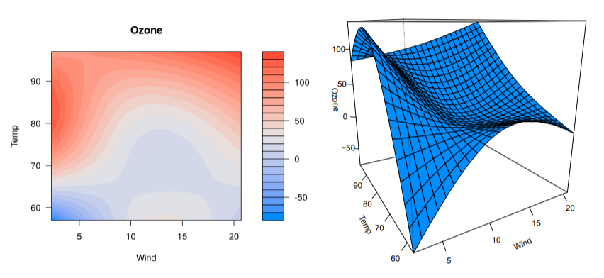
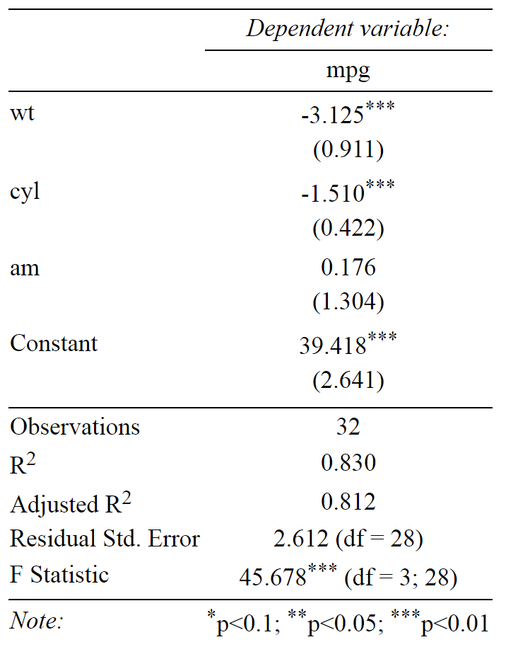
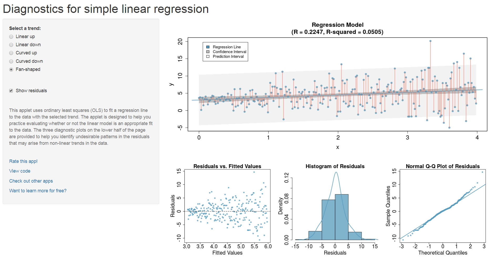

```{r, include=FALSE}
knitr::opts_chunk$set(echo = TRUE,warning=F,message=F,eval=T,fig.width=12, fig.height=5)
pres <- T
```


```{r,echo=F}
dat <- readstata13::read.dta13("../data/ZA5666_v1-0-0_Stata14.dta")
datf <- readstata13::read.dta13("../data/ZA5666_v1-0-0_Stata14.dta",
                  convert.factors = F)

```


## Gute Literatur für lineare Regression in R

<!--
### Nützliches PDF-Dokument:
-->
### J H Maindonald - [Using R for Data Analysis and Graphics
Introduction, Code and Commentary](https://cran.r-project.org/doc/contrib/usingR.pdf)

-  Introduction to R 
-  Data analysis
-  Statistical models
-  Inference concepts
-  Regression with one predictor
-  Multiple linear regression
-  Extending the linear model
-  ...


## Variablen im `mtcars` Datensatz

Hilfe File für den `roller` Datensatz:

```{r,eval=F}
?mtcars
```
<!--
displacement - Hubraum
-->
-	 mpg -	 Meilen/(US) Gallone
-	 cyl -	 Anzahl der Zylinder


## Datensatz `mtcars`

```{r,echo=F}
library(knitr)
kable(mtcars)
```


## Verteilungen von zwei Variablen aus dem Datensatz `mtcars`

```{r,fig.width=12, fig.height=5}
par(mfrow=c(1,2))
plot(density(mtcars$wt)); plot(density(mtcars$mpg))
```


## Ein einfaches Regressionsmodell

### Abhängige Variable - Meilen pro Gallone (`mpg`)

### Unabhängige Variable - Gewicht (`wt`)

```{r}
m1 <- lm(mpg ~ wt,data=mtcars)
m1
```

## Die Modell Zusammenfassung:

```{r}
summary(m1) 
```

## Die Modellformel

### Modell ohne Achsenabschnitt

```{r}
m2 <- lm(mpg ~ - 1 + wt,data=mtcars)
summary(m2)$coefficients
```

### Weitere Variablen hinzufügen

```{r}
m3 <- lm(mpg ~ wt + cyl,data=mtcars)
summary(m3)$coefficients
```

## [**Weitere Möglichkeiten, die Formel zu spezifizieren**](https://cran.r-project.org/web/packages/Formula/vignettes/Formula.pdf)

### Interaktionseffekt

```{r}
# effect of cyl and interaction effect:
m3a<-lm(mpg~wt*cyl,data=mtcars) 

# only interaction effect:
m3b<-lm(mpg~wt:cyl,data=mtcars) 
```


```{r,eval=F,echo=F}
m3c<-lm(mpg~cyl|wt,data=mtcars)

m3c<-lm(mpg~cyl/wt,data=mtcars)


summary(m3b)
summary(m3c)
```


### Den Logarithmus nehmen

```{r,eval=F}
m3d<-lm(mpg~log(wt),data=mtcars) 
```


<!--
https://www.r-bloggers.com/r-tutorial-series-regression-with-interaction-variables/

https://www.r-bloggers.com/interpreting-interaction-coefficient-in-r-part1-lm/
-->

## Ein Modell mit Interaktionseffekt

### Variable `disp`	-  Hubraum

<!--
drat - Hinterachsenübersetzung
disp - Hubraum
-->

```{r}
m3d<-lm(mpg~wt*disp,data=mtcars) 
m3dsum <- summary(m3d)
m3dsum$coefficients
```


<!--
## [**Interaktionen untersuchen**](https://cran.r-project.org/web/packages/jtools/vignettes/interactions.html)

### `jtools` -  Analysis and Presentation of Social Scientific Data

```{r,eval=F,echo=F}
install.packages("jtools")
```

```{r,eval=F,echo=T}
library(jtools)
interact_plot(m3d, pred = "wt", modx = "disp")
```

- Wenn Interaktions-Variable stetig (hier `disp`) erhält man drei Linien: 
- 1 - (mw), 2 - (mw - sd) und (mw + sd) 
-->

<!--

-->


```{r,eval=F,echo=F}
library(jtools)
fitiris <- lm(Petal.Length ~ Petal.Width * Species, data = iris)
interact_plot(fitiris, pred = "Petal.Width", modx = "Species")
```

## Das R-Paket `interplot`

> Plot the Effects of Variables in Interaction Terms

```{r}
library(interplot)
```


- Eine detailliertere Erklärung findet man in der [**`Interplot`**](https://cran.r-project.org/web/packages/interplot/vignettes/interplot-vignette.html) Vignette

{height=80%}

## Das R-Paket `interplot`

```{r,eval=F,echo=F}
interplot(m = m3d, var1 = "disp", var2 = "wt", hist = TRUE) +
  aes(color = "pink") + theme(legend.position="none") +   
  geom_hline(yintercept = 0, linetype = "dashed")
```

- Der Effekt wird auf der y Achse abgetragen - `wt` auf der x-Achse

```{r,eval=T}
interplot(m = m3a, var1 = "wt", var2 = "cyl", hist = TRUE)  
```

<!--

-->

## Beispiel: Objekt Orientierung

- `m3` ist nun ein spezielles Regressionsobjekt
- Verschiedene Funktionen können auf dieses Objekt angewendet werden. 

```{r,eval=F}
predict(m3) # Prediction
resid(m3) # Residuals
```

```{r,echo=F}
head(predict(m3)) # Prediction
head(resid(m3)) # Residuals
```


## Eine Modellvorhersage machen

```{r}
pre <- predict(m1)
head(mtcars$mpg)
head(pre)
```


## Residuenplot - Modellannahmen verletzt? 


- Gibt es ein Muster in der Abweichung von der Linie 

```{r,eval=pres}
plot(m3,1)
```

<!--

-->


## Residuenplot

```{r}
plot(m3,2)
```

- Wenn die Residuen normalverteilt sind, dann sollten sie auf der gleichen Linie liegen.


## Regressionsdiagnostik mit Basis-R

```{r,fig.width=12, fig.height=5}
plot(mtcars$wt,mtcars$mpg)
abline(m1)
segments(mtcars$wt, mtcars$mpg, mtcars$wt, pre, col="red")
```
<!--

-->

```{r,echo=F,eval=F}
# https://www.r-bloggers.com/marginal-effects-for-regression-models-in-r-rstats-dataviz/
p <- ggpredict(m5, c("wt", "cyl"))
plot(p)
```


## Das `visreg`-Paket

```{r,eval=F}
install.packages("visreg")
```

```{r}
library(visreg)
```



## Das `visreg`-Paket

- Das Default-Argument für `type` ist `conditional`.
- Scatterplot von `mpg` und `wt` mit Regressionslinie und Konfidenzbändern

```{r,eval=F}
visreg(m1, "wt", type = "conditional")
```

```{r,eval=T,echo=F,fig.width=12, fig.height=5}
visreg(m1, "wt", type = "conditional",
      line=list(col="red"),
       fill=list(col="#473C8B"),points=list(cex=1.5,col=rgb(0,1,0,.5)))
```

<!--

-->

## [**Visualisierung mit `visreg`**](http://myweb.uiowa.edu/pbreheny/publications/visreg.pdf)

- [Zweites Argument](http://pbreheny.github.io/visreg) -  Spezifikation der Kovariaten in der Graphik
- Das Diagramm zeigt die Auswirkung auf den erwarteten Wert des Regressors, wenn die Variable x von einem Referenzpunkt auf der x-Achse wegbewegt wird (bei numerischen Variablen der Mittelwert).

```{r,eval=F}
visreg(m1, "wt", type = "contrast")
```


```{r,echo=F,eval=T,fig.width=12, fig.height=5}
visreg(m1, "wt", type = "contrast",alpha=.01,
       line=list(col="red"),
       fill=list(col="#473C8B"),points=list(cex=1.5,col=rgb(.4,.4,0,.5)))
```

<!--

-->

## Regression mit Faktoren

- Die Effekte von Faktoren können auch mit `visreg` visualisiert werden:

```{r}
mtcars$cyl <- as.factor(mtcars$cyl)
m4 <- lm(mpg ~ cyl + wt, data = mtcars)
# summary(m4)
```

```{r,echo=F}
sum_m4 <- summary(m4)
sum_m4$coefficients
```


## Effekte von Faktoren


```{r,eval=F}
par(mfrow=c(1,2))
visreg(m4, "cyl", type = "contrast")
visreg(m4, "cyl", type = "conditional")
```

```{r,eval=T,echo=F}
par(mfrow=c(1,2))
visreg(m4, "cyl", type = "contrast",fill=list(col=c("#00FFFF")),points=list(cex=1.5,col=rgb(.4,.4,.4,.5)))
visreg(m4, "cyl", type = "conditional",fill=list(col=c("#00FFFF")),points=list(cex=1.5,col=rgb(.4,.4,.4,.5)))
```

<!--

-->

## Das Paket `visreg` - Interaktionen

```{r}
m5 <- lm(mpg ~ cyl*wt, data = mtcars)
# summary(m5)
```

```{r,echo=F}
sum_m5 <- summary(m5)
sum_m5$coefficients
```


## Den Graphikoutput mit `layout` kontrollieren

```{r,eval=F}
visreg(m5, "wt", by = "cyl",layout=c(3,1))
```


```{r,eval=pres,echo=F, fig.height=3}
visreg(m5, "wt", by = "cyl",layout=c(3,1),fill=list(col=c("#00FFFF")),points=list(cex=1.5,col=rgb(.4,.4,.4,.5)))
```

<!--

-->


## Das Paket `visreg` - Interaktionseffekte übereinander legen

```{r}
m6 <- lm(mpg ~ hp + wt * cyl, data = mtcars)
```


```{r,eval=pres}
visreg(m6, "wt", by="cyl", overlay=TRUE, partial=FALSE)
```

<!--

-->

## Das Paket `visreg` - `visreg2d`

```{r}
visreg2d(m6, "wt", "hp", plot.type = "image")
```

## Das Paket `visreg` - `surface`

```{r, fig.height=6}
visreg2d(m6, "wt", "hp", plot.type = "persp")
```


## B3A Aufgabe lineare Regression

Der Datensatz `toycars` beschreibt die Route von drei Spielzeugautos, die Rampen in verschiedenen Winkeln absteigen.

- angle: Rampenwinkel
- distance: Entfernung die von dem Spielzeugauto zurück gelegt wird. 
- car: Autotyp (1, 2 or 3)

a) Lese den Datensatz `toycars` ein  und konvertiere die Variable `car` des Datensatzes in einen Faktor (`as.factor`).
(b) Erstelle drei Box-Plots, in denen die von den Autotypen zurückgelegte Strecke visualisiert wird.

## B3A Aufgabe lineare Regression II


(c) Schätze für jeden Autotyp getrennt die Parameter des folgenden linearen Modell; nutze dafür die Funktion `lm()` 

$$ distance_i= \beta_0 + \beta_1 \cdot angle_i + \epsilon_i$$

(d) Überprüfe die Anpassung des Modells indem Du die drei Regressionslinien in den Scatterplot einzeichnest (`distance` gegen `angle`). Spricht das $$ R^2 $$ für eine gute Modellanpassung?


## Einen schönen Output mit dem Paket [**`stargazer`**](https://cran.r-project.org/web/packages/stargazer/vignettes/stargazer.pdf)
erzeugen

```{r,eval=F,echo=F}
install.packages("stargazer")
```

```{r,eval=F}
library(stargazer)
stargazer(m3, type="html")
```

### Beispiel HTML Outputs:




## Shiny App - Diagnostiken für die einfache lineare Regression

https://gallery.shinyapps.io/slr_diag/



- Shiny App - [**Eine einfache lineare Regression**](https://gallery.shinyapps.io/simple_regression/)

- Shiny App - [**Multikollinearität in multiplen Regressionen testen**](figure/https://gallery.shinyapps.io/collinearity/)

## Links - lineare Regression

-  Regression - [**r-bloggers**](http://www.r-bloggers.com/r-tutorial-series-simple-linear-regression/)

-  Das komplette Buch von  [**Faraway**](http://cran.r-project.org/doc/contrib/Faraway-PRA.pdf)- sehr intuitiv geschriebenes Buch

-  Gute Einführung auf [**Quick-R**](http://www.statmethods.net/stats/regression.html)

- [**Multiple Regression**](https://www.r-bloggers.com/multiple-regression-part-1/)

- [**15 Arten von Regressionen die man kennen sollte**](https://www.r-bloggers.com/15-types-of-regression-you-should-know/)

- [**`ggeffects` - Erzeuge saubere Datensätze mit marginellen Effekten für ‘ggplot’ aus Modell Outputs**](https://strengejacke.github.io/ggeffects/)


<!--
https://www.r-bloggers.com/elegant-regression-results-tables-and-plots-in-r-the-finalfit-package/
https://www.r-bloggers.com/regression-analysis-essentials-for-machine-learning/
https://www.r-bloggers.com/15-types-of-regression-you-should-know/
https://www.r-bloggers.com/marginal-effects-for-regression-models-in-r-rstats-dataviz/
http://pbreheny.github.io/visreg/contrast.html
-->