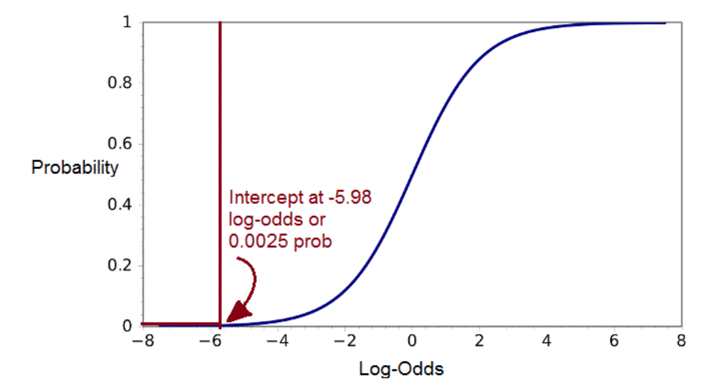

```{r, include=FALSE}
knitr::opts_chunk$set(echo = TRUE,warning=F,message=F,eval=T, fig.height=4)
```

```{r,echo=F}
sysinfo <- Sys.info()
if (sysinfo["nodename"]=="MAC14077"){
  GESIS <- T
}else{
  GESIS <- F
}
athome <- !GESIS
```


```{r,echo=F}
showsolut=F
```

```{r,eval=GESIS,echo=F}
gpdata_path <- "D:/Daten/GitLab/IntroDataAnalysis/"
```

```{r,eval=athome,echo=F}
gpdata_path <- "D:/gitLab/IntroDataAnalysis/"
```


```{r,echo=F}
dat <- readstata13::read.dta13(paste0(gpdata_path,"/data/ZA5666_v1-0-0_Stata14.dta"))
datf <- readstata13::read.dta13(paste0(gpdata_path,"/data/ZA5666_v1-0-0_Stata14.dta"),
                  convert.factors = F)

```

## Agresti - [**Categorical Data Analysis
 (2002)**](https://mathdept.iut.ac.ir/sites/mathdept.iut.ac.ir/files/AGRESTI.PDF)


- Sehr intuitiv geschriebenes Buch 
- Sehr detailliertes Skript von [**Laura A. Thompson**](http://statweb.stanford.edu/~owen/courses/306a/Splusdiscrete2.pdf)
- Das Buch behandelt die kategoriale Datenanalyse ganz grundsätzlich.

## Faraway Bücher zum Thema Regression


-  Logistische Regression eingängig erklärt
-  Beispiel mit R-Code
    - Faraway - [**Extending the linear model with R**](http://www.maths.bath.ac.uk/~jjf23/ELM/scripts2/index.html)
    - Faraway - [**Practical Regression and Anova using R**](https://cran.r-project.org/doc/contrib/Faraway-PRA.pdf)
    
## Importieren des GESIS Panels Datensatzes

```{r,eval=GESIS}
library(readstata13)
pathname <-"D:/Daten/GitLab/IntroDataAnalysis/data/"
datname <- "ZA5666_v1-0-0_Stata14.dta"
datf <- read.dta13(paste0(pathname,datname),
                   convert.factors = F)
```

Das Argument `convert.factors`:

- `logical`. Wenn TRUE, werden Faktoren aus dem Stata Werte Labeln erzeugt.

## Eine Funktion um fehlende Werte zu rekodieren

```{r,echo=T}
code_miss <- function(var){
  misvals <- c(-11,-22,-33,-44,-55,-66,-77,-88,-99,-111)
  var[var %in% misvals] <- NA
  return(var)
}
```


## Variablen für das `glm`

- a11d056z: Altersgruppe 

```{r}
table(datf$a11d056z)
```


```{r}
age <- code_miss(datf$a11d056z)
```


```{r}
table(age)
```


## GP Variable a11d094a: Kinder unter 16 Jahre

Leben in Ihrem Haushalt Kinder unter 16 Jahren?

- 1 Ja
- 2 Nein

```{r}
children <- as.factor(code_miss(datf$a11d094a))
table(children)
```


## Conditional Density Plot (GESIS Panel)

```{r}
cdplot(children ~ age)
```


## Binäre abhängige Variablen im `glm`

-  Die [**logistische Regression**](http://data.princeton.edu/R/glms.html) ghört zur Klasse der  generalisierten linearen Modellen (GLM)
-  Die Funktion zur Schätzung eines Modells dieser Klasse heißt `glm()`


### Ein `glm` spezifizieren

- Formel-Objekt 
- die Klasse (binomial, gaussian, gamma) 
- mit einer Link Funktion (logit, probit, cauchit, log, cloglog)

muss spezifiziert 


## [Logistische Regression](http://ww2.coastal.edu/kingw/statistics/R-tutorials/logistic.html) mit R

```{r}
glm_1 <- glm(children ~ age, 
                    family = binomial())
```

```{r}
sum_glm1 <- summary(glm_1)
sum_glm1$coefficients
```

<!--
-->

## [**Die Koeffizienten interpretieren**](https://www.sfu.ca/~jackd/Stat302/Wk12-2_Full.pdf)

Wir betrachten das logistische Modell der Kinder im Haushalt als eine Funktion des Alters.

```{r}
sum_glm1$coefficients
```

- Die Schätzungen und Standardfehler werden mit Log Odds angegeben, nicht mit der Wahrscheinlichkeit.

- Die p-Werte bedeuten das Gleiche, wie bei der linearen Regression.

## Der inverse Logit

```{r}
sum_glm1$coefficients
```

```{r,eval=F,echo=F}
install.packages("faraway")
```


```{r,echo=F}
library(faraway)
```


- Die Koeffizienten können nicht so einfach interpretiert werden 
<!--
wie "die Kinder im Haushalt in der Altersgruppe 0" interpretiert werden. 
-->
- Wir müssen den inversen Logit verwenden, um etwas auszusagen.

Werte für die Log-odds von `r sum_glm1$coefficients[2,1]`  sind das Gleiche, wie die Wahrscheinlichkeit: 
`r ilogit(sum_glm1$coefficients[2,1])`.

```{r}
faraway::ilogit(sum_glm1$coefficients[1,1])
```

## Zum Achsenabschnitt in einem logistischen Modell

- Es ist möglich, dass der Schätzwert für den Achsenabschnitt kleiner als null ist.
- Das bedeuted, dass die log-odds negativ sind und NICHT die Wahrscheinlichkeit.
- Ein Log-Odd Wert von 0 bedeuted eine Wahrscheinlichkeit von 
0.5.

## Log-odds und die Wahrscheinlichkeit

- Die Log-odds steigen an, wenn die Wahrscheinlichkeit auch ansteigt.

Daraus folgt...

- Ein postivier Steigungskoeffizeint bedeutet, dass der Response-Wert mit zunehmenden Wert für die erklärende Variable auch zunimmt. 

- In unserem Fall heißt das: Die Wahrscheinlichkeit, dass sich im Haushalt Kinder befinden steigt mit dem Alter des Befragten.

## Das Ergebnis graphisch darstellen


```{r,eval=F,echo=F}
fit_prob <- exp(predict(glm_1))/(1+exp(predict(glm_1)))

library(ggplot2)
dfex <- data.frame(age,fit_prob)
ggplot(aes(x=age, y=fit_prob))  +
  geom_line(aes(x=age, y=fit_prob))
```

Es resultiert eine Sigmoid-Kurve, anstatt einer Gerade mit konstanter Steigungsrate wie bei der linearen Regression.




<!--
http://www.shizukalab.com/toolkits/plotting-logistic-regression-in-r
-->

## Logistische Regressionsformel

### Das Modell als Formel:

Log-Odds( Children) =  `r sum_glm1$coefficients[1,1]` + `r sum_glm1$coefficients[2,1]`(Age) + Fehler

- Wir können Werte in die Formel einsetzen um die vorhergesagten Log-Odds für unterschiedliche Altersklassen zu bekommen.

### Beispiel: Log-Odds für die Altersgruppe 5

```{r,echo=F}
res1 <- sum_glm1$coefficients[1,1] + sum_glm1$coefficients[2,1]*5
```


`r sum_glm1$coefficients[1,1]` + `r sum_glm1$coefficients[2,1]`*(5) =  `r res1`


Wahrscheinlichkeit für Kinder in der Altersgruppe 5

```{r}
ilogit(0.3935251)
```


## [**Die Ergebnisse interpretieren**](https://www.r-bloggers.com/how-to-perform-a-logistic-regression-in-r/)

```{r}
anova(glm_1, test="Chisq")
```

  
## Die Devianz

<!--
https://www.tu-chemnitz.de/hsw/psychologie/professuren/method/homepages/ts/methodenlehre/LogReg.pdf
-->

### Abweichung vom Idealwert

- Zweimal die Differenz zwischen der maximalen Log-Likelihood $\ell^{(M)}$ und dem Wert für das angepasste Modell

- Je niedriger die Devianz, desto besser.

```{r,eval=F,echo=F}
glm_1 <- glm(children ~ age, 
                    family = binomial())
glm_0 <- glm(children ~ 1, 
                    family = binomial())
sum_glm0 <- summary(glm_0)
sum_glm1 <- summary(glm_1)
```


<!--
https://stat.ethz.ch/~stahel/courses/regcourse/sccourse2.pdf
-->

```{r}
sum_glm1 <- summary(glm_1)
sum_glm1$deviance
```


## [Mc Fadden’s $R^2$](https://www.r-bloggers.com/evaluating-logistic-regression-models/
)

```{r}
library(pscl)
pR2(glm_1) 
```


<!--
- llh	
The log-likelihood from the fitted model
- llhNull	
The log-likelihood from the intercept-only restricted model
- G2	
Minus two times the difference in the log-likelihoods
- McFadden	
McFadden's pseudo r-squared
- r2ML	
Maximum likelihood pseudo r-squared
- r2CU	
Cragg and Uhler's pseudo r-squared
-->

<!--
## Deviance residuals

- [Pearson VS Deviance Residuals in logistic regression](https://stats.stackexchange.com/questions/166585/pearson-vs-deviance-residuals-in-logistic-regression)

```{r}
summary(sum_glm1$deviance.resid)
```
-->

<!--
https://www.stat.ubc.ca/~rollin/teach/536w10/lec16.pdf
-->
<!--
## Place of living and satisfaction
-->

## Großstadtnähe Wohngegend

### Wie weit ist es von Ihrer Wohnung bis ins Zentrum der nächsten Großstadt?

- 1 - Im Großstadtzentrum
- 6 - 60 km und mehr

```{r}
region <- code_miss(datf$bczd001a)
table(region)
```

## Zufriedenheit Leben in Wohnort

### Alles in allem, wie zufrieden sind Sie mit dem Leben in [Wohnort]?

- 1 - Sehr zufrieden
- 5 - Sehr unzufrieden

```{r}
satisfactionplace <- datf$a11c019a
table(satisfactionplace)
```


## Ein anderes Modell

```{r,eval=T,echo=T}
glm_2 <- glm(children ~ age + satisfactionplace*region, 
                    family = binomial())
```

```{r,eval=F,echo=F}
# https://www.r-bloggers.com/evaluating-logistic-regression-models/
anova(glm_2, test="Chisq")
```

```{r}
pseudor2 <- pR2(glm_2) 
pseudor2["McFadden"]
```


## Eine weitere Variable aus dem GESIS Panel Datensatz

- Anzahl Tattoos:

```{r}
Tatoos <- code_miss(datf$bdao067a)
Tatoos[Tatoos==97]<-0
```

```{r}
table(Tatoos)
```


```{r,eval=F,echo=F}
table(datf$bczd001a)
```


## Generalisierte Regression mit R - Mehr Funktionen

- Logistisches Modell mit einem Probit Link:

```{r}
probitmod <- glm(children ~ age, 
	family=binomial(link=probit))
```

- Regression mit Zähldaten:

```{r}
modp <- glm(Tatoos ~ age,family=poisson)
```

- Proportional Odds logistic Regression aus dem Paket `MASS`:

```{r}
library("MASS")
mod_plr<-polr(a11c020a ~ a11d096b ,data=dat)
```

<!--
## [B4A Exercise logistic regression](https://www.r-exercises.com/2017/10/30/logistic-regression-in-r/)

- Load the `MASS` package and combine `Pima.tr` and `Pima.tr2` to a data.frame called train and save Pima.te as test. Change the coding of our variable of interest to (type) to 0 (non-diabetic) and 1 (diabetic). Check for and take note of any missing values.

```{r,echo=showsolut}

```
-->

## Linkliste - logistische Regression

-  Einführung in die [**logistische Regression**](http://ww2.coastal.edu/kingw/statistics/R-tutorials/logistic.html)


-  [**Code zum Buch von Faraway**](http://www.maths.bath.ac.uk/~jjf23/ELM/scripts/binary.R)


- [**Kategoriale Daten:**](http://homepage.univie.ac.at/herbert.nagel/KategorialeDaten.pdf) - [**Wie man eine logistische Regression in R durchführt**](https://www.r-bloggers.com/how-to-perform-a-logistic-regression-in-r/)

